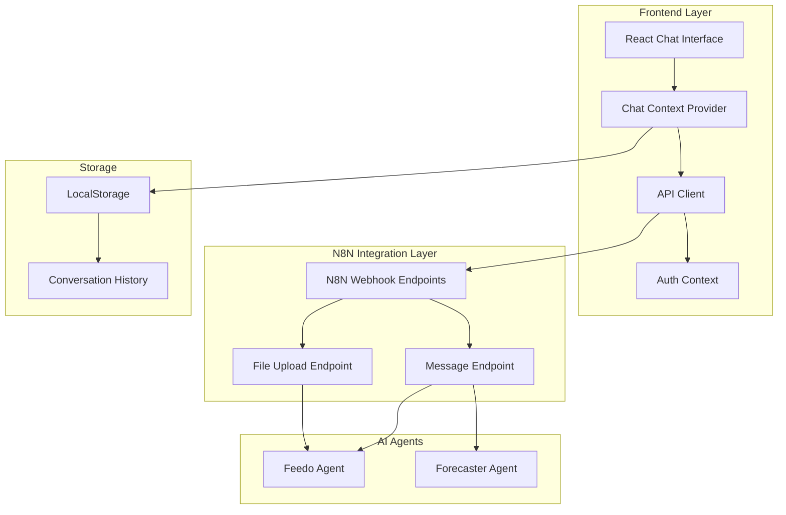
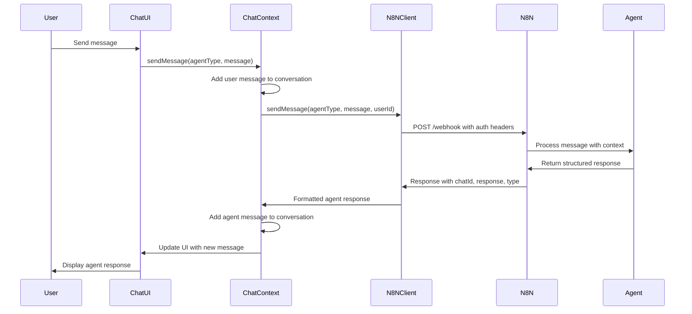
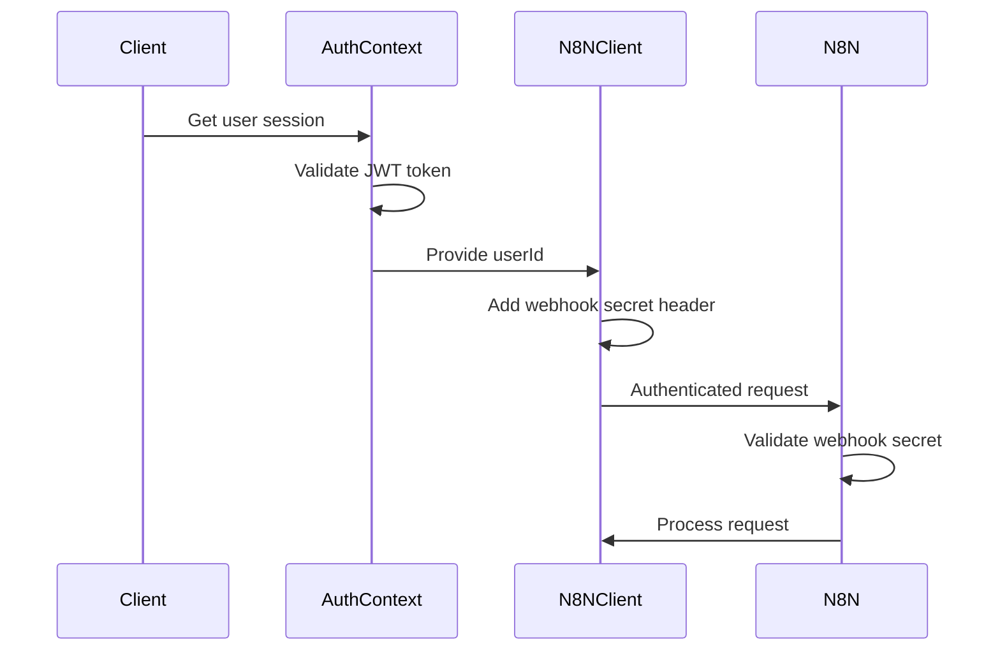

# Design Document

## Overview

This document outlines the technical design for integrating Feedo and Forecaster AI agents with n8n workflows and the existing React frontend platform. The integration will create a seamless chat interface that allows users to interact with specialized AI agents through n8n webhooks, maintaining conversation context and supporting both text and file-based interactions.

The design leverages the existing authentication system and extends the current platform architecture to include agent communication capabilities. The solution prioritizes real-time user feedback, secure communication, and scalable conversation management.

## Architecture

### High-Level Architecture



### Communication Flow



## Components and Interfaces

### 1. N8N Client (`src/utils/n8nClient.js`)

**Purpose**: Handles all communication with n8n webhooks, including authentication, request formatting, and response processing.

**Key Features**:
- Axios-based HTTP client with custom interceptors
- Automatic authentication header injection
- Request/response logging and error handling
- File upload support with validation
- Conversation context management via chatId

**Interface**:
```javascript
export const n8nApi = {
  sendMessage(agentType, message, userId, context = {}),
  uploadFile(agentType, file, userId, context = {}),
  sendCommand(agentType, command, userId, parameters = {}),
  getConversationHistory(agentType, userId),
  clearContext(userId, agentType)
}

export const n8nHelpers = {
  validateAgentResponse(response),
  formatAgentResponse(response),
  isProcessing(response),
  extractFileResults(response)
}
```

**Configuration**:
```javascript
const N8N_CONFIG = {
  MESSAGES_ENDPOINT: 'https://sebasduque.app.n8n.cloud/webhook-test/cacf2ea9-bd03-4772-aac8-65decab7cc6b',
  FILES_ENDPOINT: 'https://sebasduque.app.n8n.cloud/webhook-test/ba4f9473-3c18-46f3-a4a9-da9240728f3a',
  WEBHOOK_SECRET: 'T3CHN04G3NT3S2025@',
  TIMEOUT: 30000,
  // N8N HTTP Request Node Configuration
  REQUEST_METHOD: 'POST',
  CONTENT_TYPE: 'application/json',
  AUTHENTICATION_TYPE: 'Header Auth', // Using Header Auth as per n8n docs
  AUTH_HEADER_NAME: 'Feedo-Webhook-Secret'
}
```

### 2. Chat Context Provider (`src/context/ChatContext.jsx`)

**Purpose**: Manages global chat state, conversation history, and agent interactions using React Context API.

**State Structure**:
```javascript
const initialState = {
  conversations: {
    feedo: {
      messages: [],
      chatId: null,
      isProcessing: false,
      lastActivity: null
    },
    forecaster: {
      messages: [],
      chatId: null,
      isProcessing: false,
      lastActivity: null
    }
  },
  activeAgent: null,
  fileProcessing: {
    isUploading: false,
    uploadProgress: 0,
    processedFiles: [],
    errors: []
  },
  loading: false,
  error: null
}
```

**Actions**:
- `SET_ACTIVE_AGENT`: Switch between agents
- `ADD_MESSAGE`: Add message to conversation
- `SET_PROCESSING`: Update processing state
- `FILE_UPLOAD_*`: Handle file upload states
- `CLEAR_CONVERSATION`: Reset conversation history

### 3. Enhanced Chat Page (`src/pages/ChatPage.jsx`)

**Purpose**: Main chat interface with agent selection, message display, and file upload capabilities.

**Key Features**:
- Agent selection sidebar with status indicators
- Real-time message display with typing indicators
- File upload integration for Feedo agent
- Quick command shortcuts
- Error handling and retry mechanisms
- Responsive design with mobile support

**Agent Configuration**:
```javascript
const agents = [
  {
    id: 'feedo',
    name: 'Feedo',
    description: 'Data analysis and processing specialist',
    avatar: '🚚',
    color: 'bg-blue-100 text-blue-700',
    capabilities: ['file_upload', 'data_processing', 'analysis']
  },
  {
    id: 'forecaster',
    name: 'Forecaster',
    description: 'Forecasting and trend analysis expert',
    avatar: '📊',
    color: 'bg-green-100 text-green-700',
    capabilities: ['predictions', 'trends', 'forecasting']
  }
]
```

### 4. Enhanced File Upload Component (`src/components/FileUpload.jsx`)

**Purpose**: Handles file selection, validation, and upload to n8n file processing endpoint.

**Features**:
- Drag and drop interface
- File type and size validation
- Progress tracking
- Compact mode for in-conversation uploads
- Error handling with user feedback

**Supported File Types**:
- CSV (.csv)
- Excel (.xlsx, .xls)
- JSON (.json)
- Text (.txt)
- Maximum size: 10MB

## Data Models

### Message Structure

```javascript
const Message = {
  id: Number,                    // Unique message identifier
  text: String,                  // Message content
  sender: 'user' | 'agent' | 'system', // Message sender type
  timestamp: Date,               // Message timestamp
  type: 'text' | 'file' | 'error' | 'command', // Message type
  agentType: 'feedo' | 'forecaster', // Associated agent
  metadata: {                    // Optional metadata
    fileName?: String,           // For file messages
    fileSize?: Number,           // File size in bytes
    processingTime?: Number,     // Agent processing time
    command?: Boolean,           // Command message flag
    parameters?: Object          // Command parameters
  }
}
```

### N8N HTTP Request Configuration

Based on n8n HTTP Request node documentation, our requests will be configured as follows:

**Method**: POST
**Authentication**: Header Auth
- Header Name: `Feedo-Webhook-Secret`
- Header Value: `T3CHN04G3NT3S2025@`

**Send Headers**: Yes
- Content-Type: `application/json`
- X-Request-Timestamp: `ISO 8601 timestamp`

**Send Body**: Yes
- Body Content Type: JSON
- Using JSON option for structured data

### N8N Request Payload

```javascript
const N8NRequest = {
  chatId: String,                // Persistent conversation ID
  message: String,               // User message content
  type: 'text' | 'file' | 'command', // Request type
  agentType: 'feedo' | 'forecaster', // Target agent
  userId: String,                // Authenticated user ID
  timestamp: String,             // ISO 8601 timestamp
  context: Object                // Additional context data
}
```

### N8N File Upload Configuration

For file uploads, we'll use:

**Method**: POST
**Authentication**: Header Auth (same as above)
**Send Body**: Yes
- Body Content Type: Form-Data
- Parameter Type: n8n Binary File for file data
- Additional Form Data fields for metadata

### N8N Response Structure

```javascript
const N8NResponse = {
  chatId: String,                // Same chatId for continuity
  response: String,              // Agent response content
  type: 'text' | 'data' | 'error' | 'processing', // Response type
  agentType: 'feedo' | 'forecaster', // Responding agent
  metadata: {                    // Optional response metadata
    processingTime?: Number,     // Processing duration
    fileName?: String,           // Processed file name
    records?: Number,            // Number of records processed
    columns?: Array,             // Data columns
    summary?: String             // Processing summary
  },
  timestamp: String              // ISO 8601 timestamp
}
```

### Conversation State

```javascript
const ConversationState = {
  messages: Array<Message>,      // Conversation messages
  chatId: String | null,         // N8N conversation ID
  isProcessing: Boolean,         // Agent processing status
  lastActivity: String | null    // Last activity timestamp
}
```

## Error Handling

### Error Categories

1. **Network Errors**: Connection timeouts, network unavailability
2. **Authentication Errors**: Invalid webhook secret, expired tokens
3. **Validation Errors**: Invalid file types, size limits exceeded
4. **Agent Processing Errors**: Agent-specific processing failures
5. **System Errors**: Unexpected server errors

### Error Handling Strategy

```javascript
const ErrorHandler = {
  // Network error handling
  handleNetworkError(error) {
    if (error.code === 'ECONNABORTED') {
      return 'Agent processing timeout. Please try again.'
    }
    return 'Network error. Please check your connection.'
  },
  
  // Authentication error handling
  handleAuthError(error) {
    if (error.response?.status === 401) {
      return 'Authentication failed. Please refresh the page.'
    }
    return 'Authorization error occurred.'
  },
  
  // File upload error handling
  handleFileError(error) {
    if (error.response?.status === 413) {
      return 'File too large. Maximum size is 10MB.'
    }
    return 'File upload failed. Please try again.'
  }
}
```

### User Feedback Mechanisms

- **Toast Notifications**: For temporary error messages
- **Inline Error Messages**: For form validation errors
- **Retry Buttons**: For recoverable errors
- **Error Logging**: For debugging and monitoring

## Testing Strategy

### Unit Testing

**Components to Test**:
- N8N Client API methods
- Chat Context reducers and actions
- Message formatting helpers
- File validation functions

**Test Framework**: Jest + React Testing Library

**Example Test Cases**:
```javascript
describe('N8N Client', () => {
  test('should send message with correct payload', async () => {
    const response = await n8nApi.sendMessage('feedo', 'test message', 'user123')
    expect(response.success).toBe(true)
    expect(response.chatId).toBeDefined()
  })
  
  test('should handle authentication errors', async () => {
    // Mock 401 response
    const response = await n8nApi.sendMessage('feedo', 'test', 'user123')
    expect(response.success).toBe(false)
    expect(response.error).toContain('authentication')
  })
})
```

### Integration Testing

**Scenarios to Test**:
1. Complete conversation flow with both agents
2. File upload and processing workflow
3. Error recovery and retry mechanisms
4. Context persistence across page refreshes
5. Multi-user conversation isolation

### End-to-End Testing

**User Journeys**:
1. User selects agent → sends message → receives response
2. User uploads file → agent processes → returns analysis
3. User switches between agents → maintains separate contexts
4. Error occurs → user sees feedback → can retry

**Testing Tools**: Cypress or Playwright

## Performance Considerations

### Optimization Strategies

1. **Message Virtualization**: For large conversation histories
2. **Lazy Loading**: Load conversation history on demand
3. **Request Debouncing**: Prevent duplicate requests
4. **Caching**: Cache agent responses for repeated queries
5. **Connection Pooling**: Reuse HTTP connections

### Performance Metrics

- **Response Time**: < 2 seconds for message acknowledgment
- **File Upload**: Progress updates every 500ms
- **Memory Usage**: Limit conversation history to 100 messages
- **Network Efficiency**: Compress large payloads

### Scalability Considerations

- **Conversation Cleanup**: Automatic cleanup of old conversations
- **Rate Limiting**: Respect n8n webhook rate limits
- **Error Recovery**: Exponential backoff for failed requests
- **Resource Management**: Cleanup event listeners and timers

## Security Implementation

### Authentication Flow



### Security Measures

1. **Webhook Authentication**: All requests include `Feedo-Webhook-Secret` header
2. **User Authentication**: Verify user session before agent interactions
3. **Input Sanitization**: Sanitize user messages and file uploads
4. **HTTPS Only**: All communications over secure connections
5. **Token Management**: Secure storage and automatic refresh of JWT tokens

### Data Privacy

- **Conversation Isolation**: Each user's conversations are isolated
- **Data Retention**: Configurable conversation history retention
- **File Security**: Temporary file storage with automatic cleanup
- **Audit Logging**: Track all agent interactions for security monitoring

## N8N Workflow Configuration

### HTTP Request Node Setup for Message Endpoint

Based on the n8n documentation provided, here's how to configure the HTTP Request node in n8n workflows:

**Basic Configuration:**
- **Method**: POST
- **URL**: `https://sebasduque.app.n8n.cloud/webhook-test/cacf2ea9-bd03-4772-aac8-65decab7cc6b`

**Authentication:**
- **Authentication Type**: Header Auth
- **Header Name**: `Feedo-Webhook-Secret`
- **Header Value**: `T3CHN04G3NT3S2025@`

**Headers Configuration:**
- **Send Headers**: Yes
- **Using Fields Below**:
  - Name: `Content-Type`, Value: `application/json`
  - Name: `X-Request-Timestamp`, Value: `{{$now}}`

**Body Configuration:**
- **Send Body**: Yes
- **Body Content Type**: JSON
- **Using JSON**: 
```json
{
  "chatId": "{{$json.chatId}}",
  "message": "{{$json.message}}",
  "type": "{{$json.type}}",
  "agentType": "{{$json.agentType}}",
  "userId": "{{$json.userId}}",
  "timestamp": "{{$json.timestamp}}",
  "context": "{{$json.context}}"
}
```

### HTTP Request Node Setup for File Upload Endpoint

**Basic Configuration:**
- **Method**: POST
- **URL**: `https://sebasduque.app.n8n.cloud/webhook-test/ba4f9473-3c18-46f3-a4a9-da9240728f3a`

**Authentication:**
- **Authentication Type**: Header Auth
- **Header Name**: `Feedo-Webhook-Secret`
- **Header Value**: `T3CHN04G3NT3S2025@`

**Body Configuration:**
- **Send Body**: Yes
- **Body Content Type**: Form-Data
- **Parameters**:
  - **Parameter Type**: n8n Binary File
    - **Name**: `file`
    - **Input Data Field Name**: `data` (from previous node)
  - **Parameter Type**: Form Data
    - **Name**: `chatId`, **Value**: `{{$json.chatId}}`
    - **Name**: `type`, **Value**: `file`
    - **Name**: `agentType`, **Value**: `{{$json.agentType}}`
    - **Name**: `userId`, **Value**: `{{$json.userId}}`
    - **Name**: `timestamp`, **Value**: `{{$json.timestamp}}`
    - **Name**: `context`, **Value**: `{{JSON.stringify($json.context)}}`

### Expected Response Format from N8N

N8N workflows should return responses in this format:

```json
{
  "chatId": "chat_1234567890_abc123def",
  "response": "I've processed your request. Here are the results...",
  "type": "text",
  "agentType": "feedo",
  "metadata": {
    "processingTime": 1500,
    "fileName": "data.csv",
    "records": 1000,
    "summary": "Processed 1000 records successfully"
  },
  "timestamp": "2025-01-28T10:30:00.000Z"
}
```

### N8N Workflow Best Practices

1. **Error Handling**: Include error handling nodes to catch and format errors appropriately
2. **Response Validation**: Validate response structure before sending back to frontend
3. **Timeout Configuration**: Set appropriate timeouts for long-running processes
4. **Logging**: Add logging nodes for debugging and monitoring
5. **Rate Limiting**: Implement rate limiting to prevent abuse

## Deployment and Configuration

### Environment Variables

```bash
# N8N Integration
VITE_N8N_MESSAGES_ENDPOINT=https://sebasduque.app.n8n.cloud/webhook-test/cacf2ea9-bd03-4772-aac8-65decab7cc6b
VITE_N8N_FILES_ENDPOINT=https://sebasduque.app.n8n.cloud/webhook-test/ba4f9473-3c18-46f3-a4a9-da9240728f3a
VITE_N8N_WEBHOOK_SECRET=T3CHN04G3NT3S2025@

# API Configuration
VITE_API_BASE_URL=https://api-platform-dev.agentscl.com
VITE_API_TIMEOUT=30000

# Feature Flags
VITE_ENABLE_FILE_UPLOAD=true
VITE_ENABLE_QUICK_COMMANDS=true
VITE_MAX_FILE_SIZE_MB=10
```

### Build Configuration

**Vite Configuration Updates**:
```javascript
export default defineConfig({
  // ... existing config
  define: {
    __N8N_ENDPOINTS__: JSON.stringify({
      messages: process.env.VITE_N8N_MESSAGES_ENDPOINT,
      files: process.env.VITE_N8N_FILES_ENDPOINT
    })
  }
})
```

### Monitoring and Logging

**Client-Side Logging**:
```javascript
const logger = {
  info: (message, data) => console.log(`[INFO] ${message}`, data),
  error: (message, error) => console.error(`[ERROR] ${message}`, error),
  debug: (message, data) => process.env.NODE_ENV === 'development' && console.debug(`[DEBUG] ${message}`, data)
}
```

**Metrics to Track**:
- Message send/receive rates
- File upload success/failure rates
- Agent response times
- Error frequencies by type
- User engagement metrics

This design provides a robust, scalable, and secure foundation for integrating AI agents with the existing platform while maintaining excellent user experience and system reliability.