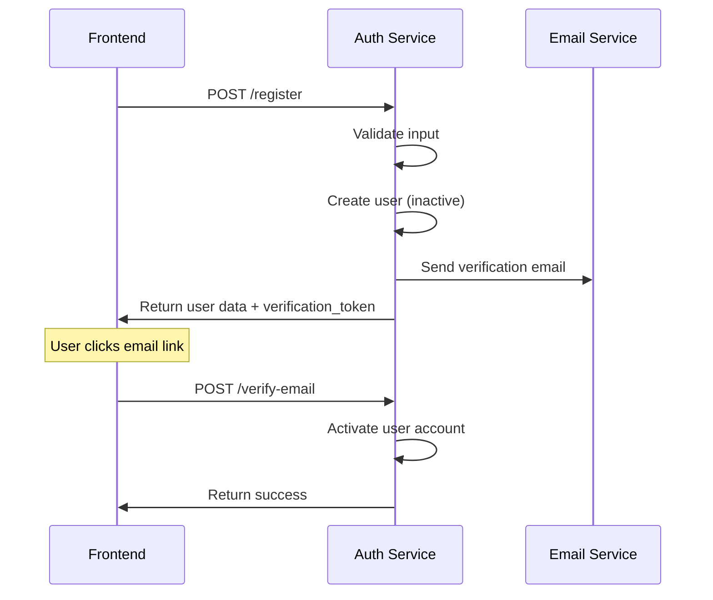
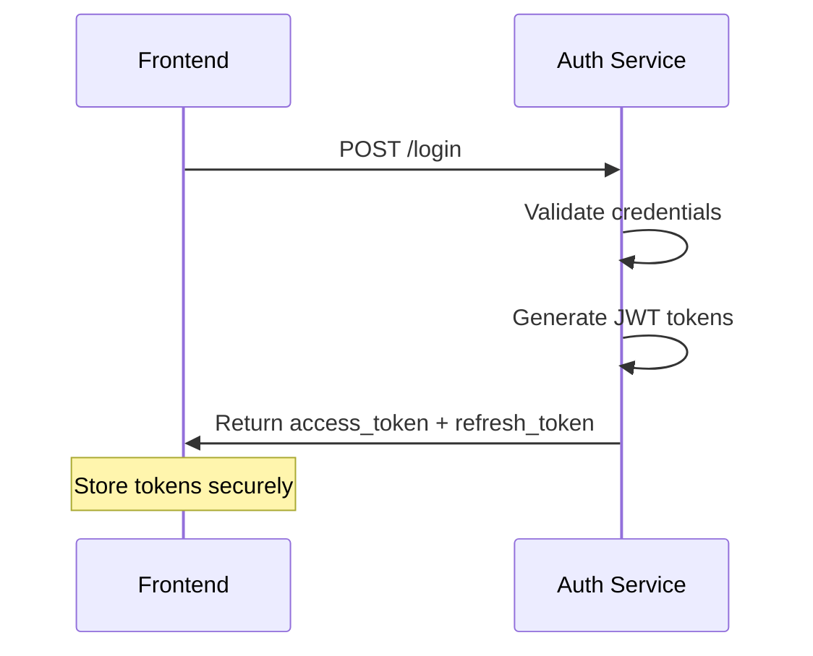
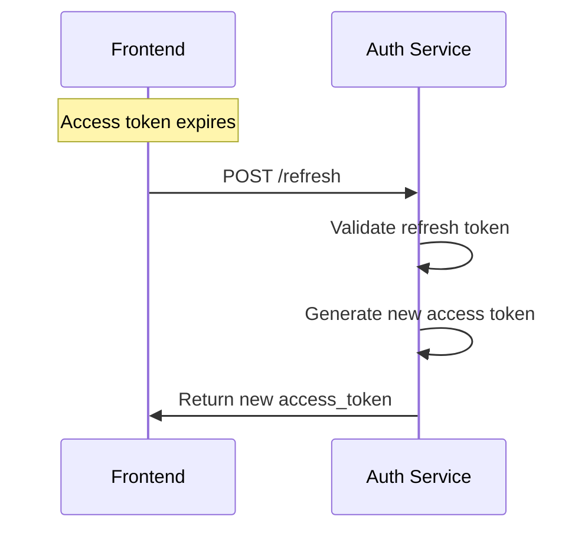
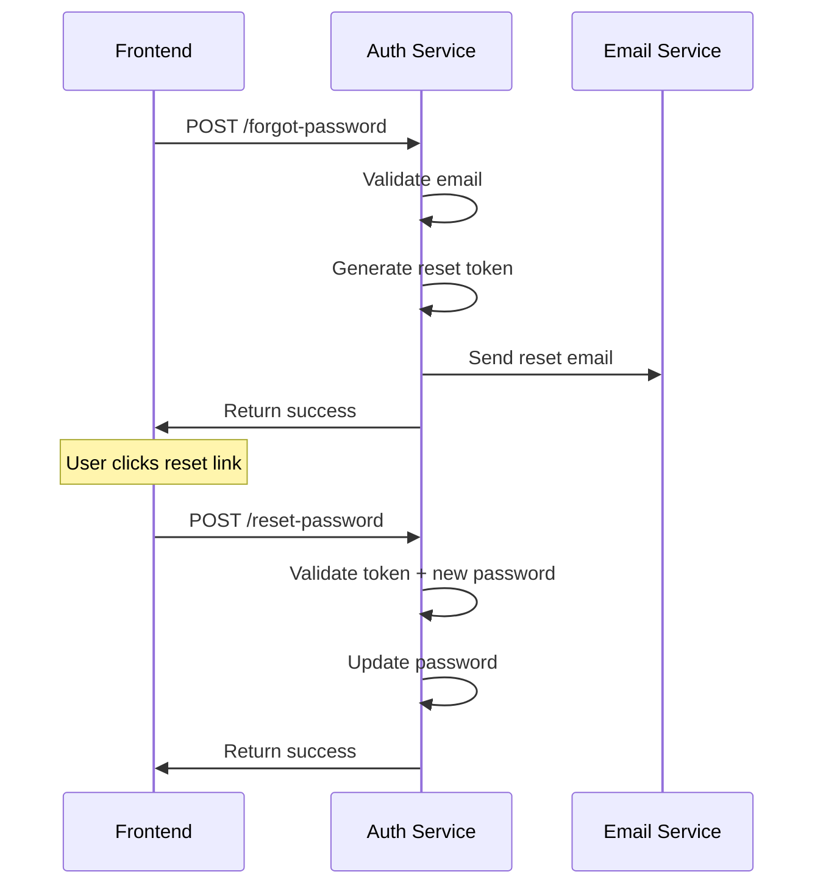

# 🔐 Auth Service - Frontend Integration Guide

## 📋 **Table of Contents**
1. [Service Overview](#service-overview)
2. [Base Configuration](#base-configuration)
3. [Authentication Flows](#authentication-flows)
4. [API Endpoints Reference](#api-endpoints-reference)
5. [Error Handling](#error-handling)
6. [Security Best Practices](#security-best-practices)
7. [Code Examples](#code-examples)
8. [Testing](#testing)

---

## 🏗️ **Service Overview**

### **Base URL**
```
Production: https://sus2ukuiqk.execute-api.us-east-1.amazonaws.com/dev/auth
Development: https://sus2ukuiqk.execute-api.us-east-1.amazonaws.com/dev/auth
```

### **Authentication Method**
- **JWT Bearer Tokens** for authenticated endpoints
- **Rate Limiting** implemented on all endpoints
- **CORS** enabled for all origins

### **Response Format**
All endpoints return standardized JSON responses:

```json
{
  "success": true,
  "data": { /* response data */ },
  "message": "Operation completed successfully",
  "timestamp": "2024-01-15T10:30:00Z"
}
```

Error responses:
```json
{
  "success": false,
  "error": {
    "code": "ERROR_CODE",
    "message": "Human readable error message"
  },
  "timestamp": "2024-01-15T10:30:00Z"
}
```

---

## ⚙️ **Base Configuration**

### **Required Headers**
```javascript
const headers = {
  'Content-Type': 'application/json',
  'Accept': 'application/json'
};

// For authenticated endpoints
const authHeaders = {
  ...headers,
  'Authorization': `Bearer ${accessToken}`
};
```

### **Rate Limits**
| Endpoint Type | Requests per Minute |
|---------------|-------------------|
| Login | 10 |
| Registration | 5 |
| Password Reset | 5 |
| Email Verification | 10 |
| Token Validation | 200 |
| Token Refresh | 20 |
| Logout | 30 |

---

## 🔄 **Authentication Flows**

### **1. User Registration Flow**



### **2. User Login Flow**



### **3. Token Refresh Flow**



### **4. Password Reset Flow**



---

## 📡 **API Endpoints Reference**

### **🔓 Public Endpoints (No Authentication Required)**

#### **1. Health Check**
```http
GET /health
```

**Response:**
```json
{
  "success": true,
  "data": {
    "service": "auth-service",
    "status": "healthy",
    "version": "1.0.0",
    "timestamp": "2024-01-15T10:30:00Z"
  }
}
```

#### **2. User Registration**
```http
POST /register
```

**Request Body:**
```json
{
  "tenant_id": "tenant-123",
  "email": "user@company.com",
  "password": "SecurePassword123!",
  "name": "John Doe",
  "role": "MASTER"
}
```

**Response:**
```json
{
  "success": true,
  "data": {
    "user_id": "user-456",
    "tenant_id": "tenant-123",
    "name": "John Doe",
    "email": "user@company.com",
    "role": "MASTER",
    "status": "inactive",
    "email_verified": false,
    "created_at": 1705320600,
    "verification_token": "verify-token-789"
  },
  "message": "User registered successfully - inactive until activation"
}
```

**Validation Rules:**
- Email: Valid email format, unique
- Password: Min 8 chars, uppercase, lowercase, number, special char
- Name: 2-100 characters
- Role: MASTER, ADMIN, MEMBER
- Tenant ID: Must exist and be active

#### **3. User Login**
```http
POST /login
```

**Request Body:**
```json
{
  "email": "user@company.com",
  "password": "SecurePassword123!"
}
```

**Response:**
```json
{
  "success": true,
  "data": {
    "access_token": "eyJhbGciOiJIUzI1NiIsInR5cCI6IkpXVCJ9...",
    "refresh_token": "eyJhbGciOiJIUzI1NiIsInR5cCI6IkpXVCJ9...",
    "expires_in": 3600,
    "token_type": "Bearer",
    "user": {
      "user_id": "user-456",
      "tenant_id": "tenant-123",
      "name": "John Doe",
      "email": "user@company.com",
      "role": "MASTER",
      "email_verified": true
    },
    "tenant": {
      "tenant_id": "tenant-123",
      "name": "Company Name",
      "plan": "PREMIUM",
      "status": "ACTIVE"
    }
  },
  "message": "Login successful"
}
```

#### **4. Email Verification**
```http
POST /verify-email
```

**Request Body:**
```json
{
  "verification_token": "verify-token-789"
}
```

**Response:**
```json
{
  "success": true,
  "data": {
    "user_id": "user-456",
    "email_verified": true,
    "verified_at": 1705320600
  },
  "message": "Email verified successfully"
}
```

#### **5. Resend Verification Email**
```http
POST /resend-verification
```

**Request Body:**
```json
{
  "email": "user@company.com"
}
```

**Response:**
```json
{
  "success": true,
  "data": {
    "verification_token": "new-verify-token-123"
  },
  "message": "Verification email sent successfully"
}
```

#### **6. Forgot Password**
```http
POST /forgot-password
```

**Request Body:**
```json
{
  "email": "user@company.com"
}
```

**Response:**
```json
{
  "success": true,
  "data": {
    "reset_token": "reset-token-456"
  },
  "message": "Password reset email sent successfully"
}
```

#### **7. Reset Password**
```http
POST /reset-password
```

**Request Body:**
```json
{
  "token": "reset-token-456",
  "new_password": "NewSecurePassword123!"
}
```

**Response:**
```json
{
  "success": true,
  "data": {
    "user_id": "user-456",
    "password_updated": true,
    "updated_at": 1705320600
  },
  "message": "Password reset successfully"
}
```

#### **8. Token Validation**
```http
POST /validate-token
```

**Request Body:**
```json
{
  "token": "eyJhbGciOiJIUzI1NiIsInR5cCI6IkpXVCJ9..."
}
```

**Response:**
```json
{
  "success": true,
  "data": {
    "valid": true,
    "payload": {
      "user_id": "user-456",
      "tenant_id": "tenant-123",
      "role": "MASTER",
      "email": "user@company.com",
      "type": "access",
      "exp": 1705324200,
      "iat": 1705320600
    },
    "is_impersonation": false
  },
  "message": "Token validation completed"
}
```

#### **9. Token Refresh**
```http
POST /refresh
```

**Request Body:**
```json
{
  "refresh_token": "eyJhbGciOiJIUzI1NiIsInR5cCI6IkpXVCJ9..."
}
```

**Response:**
```json
{
  "success": true,
  "data": {
    "access_token": "eyJhbGciOiJIUzI1NiIsInR5cCI6IkpXVCJ9...",
    "expires_in": 3600,
    "token_type": "Bearer",
    "user": {
      "user_id": "user-456",
      "tenant_id": "tenant-123",
      "name": "John Doe",
      "email": "user@company.com",
      "role": "MASTER"
    },
    "tenant": {
      "tenant_id": "tenant-123",
      "name": "Company Name"
    }
  },
  "message": "Token refreshed successfully"
}
```

#### **10. Activate Registration**
```http
POST /activate-registration
```

**Request Body:**
```json
{
  "tenant_id": "tenant-123",
  "subscription_id": "sub-456"
}
```

**Response:**
```json
{
  "success": true,
  "data": {
    "tenant_id": "tenant-123",
    "status": "ACTIVE",
    "activated_at": 1705320600
  },
  "message": "Registration activated successfully"
}
```

### **🔒 Protected Endpoints (Authentication Required)**

#### **11. Logout**
```http
POST /logout
Authorization: Bearer {access_token}
```

**Request Body:**
```json
{
  "refresh_token": "eyJhbGciOiJIUzI1NiIsInR5cCI6IkpXVCJ9..." // Optional
}
```

**Response:**
```json
{
  "success": true,
  "data": {
    "logged_out": true,
    "sessions_terminated": 1,
    "tokens_revoked": 2
  },
  "message": "Logout successful"
}
```

#### **12. Revoke Refresh Token**
```http
POST /refresh-token/revoke
Authorization: Bearer {access_token}
```

**Request Body:**
```json
{
  "refresh_token": "eyJhbGciOiJIUzI1NiIsInR5cCI6IkpXVCJ9..."
}
```

**Response:**
```json
{
  "success": true,
  "data": {
    "token_revoked": true,
    "revoked_at": 1705320600
  },
  "message": "Refresh token revoked successfully"
}
```

---

## ⚠️ **Error Handling**

### **Common Error Codes**

| Error Code | HTTP Status | Description |
|------------|-------------|-------------|
| `VALIDATION_ERROR` | 400 | Invalid request data |
| `INVALID_CREDENTIALS` | 401 | Wrong email/password |
| `AUTHENTICATION_ERROR` | 401 | Invalid or expired token |
| `AUTHORIZATION_REQUIRED` | 401 | Missing authorization header |
| `TOKEN_EXPIRED` | 401 | JWT token has expired |
| `ACCOUNT_LOCKED` | 423 | Account locked due to failed attempts |
| `EMAIL_NOT_VERIFIED` | 403 | Email verification required |
| `RESOURCE_CONFLICT` | 409 | Email already exists |
| `RATE_LIMIT_EXCEEDED` | 429 | Too many requests |
| `INTERNAL_ERROR` | 500 | Server error |

### **Error Response Examples**

**Validation Error:**
```json
{
  "success": false,
  "error": {
    "code": "VALIDATION_ERROR",
    "message": "Password must contain at least 8 characters with uppercase, lowercase, number and special character"
  },
  "timestamp": "2024-01-15T10:30:00Z"
}
```

**Authentication Error:**
```json
{
  "success": false,
  "error": {
    "code": "INVALID_CREDENTIALS",
    "message": "Invalid email or password"
  },
  "timestamp": "2024-01-15T10:30:00Z"
}
```

**Rate Limit Error:**
```json
{
  "success": false,
  "error": {
    "code": "RATE_LIMIT_EXCEEDED",
    "message": "Too many requests. Please try again later."
  },
  "timestamp": "2024-01-15T10:30:00Z"
}
```

---

## 🔒 **Security Best Practices**

### **Token Management**
1. **Store tokens securely** (httpOnly cookies or secure storage)
2. **Never expose tokens** in URLs or logs
3. **Implement automatic refresh** before token expiration
4. **Clear tokens** on logout
5. **Validate tokens** before making API calls

### **Password Requirements**
- Minimum 8 characters
- At least one uppercase letter
- At least one lowercase letter
- At least one number
- At least one special character
- Cannot contain common patterns (123, password, qwerty)

### **Request Security**
- Always use HTTPS
- Implement CSRF protection
- Validate all user inputs
- Handle errors gracefully without exposing sensitive information

---

## 💻 **Code Examples**

### **JavaScript/TypeScript Integration**

#### **Auth Service Class**
```typescript
class AuthService {
  private baseURL = 'https://sus2ukuiqk.execute-api.us-east-1.amazonaws.com/dev/auth';
  private accessToken: string | null = null;
  private refreshToken: string | null = null;

  // Set tokens after login
  setTokens(accessToken: string, refreshToken: string) {
    this.accessToken = accessToken;
    this.refreshToken = refreshToken;
    localStorage.setItem('access_token', accessToken);
    localStorage.setItem('refresh_token', refreshToken);
  }

  // Get stored tokens
  getTokens() {
    return {
      accessToken: this.accessToken || localStorage.getItem('access_token'),
      refreshToken: this.refreshToken || localStorage.getItem('refresh_token')
    };
  }

  // Clear tokens
  clearTokens() {
    this.accessToken = null;
    this.refreshToken = null;
    localStorage.removeItem('access_token');
    localStorage.removeItem('refresh_token');
  }

  // Make authenticated request
  async makeRequest(endpoint: string, options: RequestInit = {}) {
    const { accessToken } = this.getTokens();
    
    const headers = {
      'Content-Type': 'application/json',
      'Accept': 'application/json',
      ...(accessToken && { 'Authorization': `Bearer ${accessToken}` }),
      ...options.headers
    };

    const response = await fetch(`${this.baseURL}${endpoint}`, {
      ...options,
      headers
    });

    // Handle token expiration
    if (response.status === 401 && accessToken) {
      const refreshed = await this.refreshAccessToken();
      if (refreshed) {
        // Retry request with new token
        return this.makeRequest(endpoint, options);
      } else {
        // Refresh failed, redirect to login
        this.clearTokens();
        window.location.href = '/login';
        return null;
      }
    }

    return response;
  }

  // Login
  async login(email: string, password: string) {
    const response = await fetch(`${this.baseURL}/login`, {
      method: 'POST',
      headers: {
        'Content-Type': 'application/json'
      },
      body: JSON.stringify({ email, password })
    });

    const data = await response.json();
    
    if (data.success) {
      this.setTokens(data.data.access_token, data.data.refresh_token);
      return data.data;
    } else {
      throw new Error(data.error.message);
    }
  }

  // Register
  async register(userData: {
    tenant_id: string;
    email: string;
    password: string;
    name: string;
    role: string;
  }) {
    const response = await fetch(`${this.baseURL}/register`, {
      method: 'POST',
      headers: {
        'Content-Type': 'application/json'
      },
      body: JSON.stringify(userData)
    });

    const data = await response.json();
    
    if (!data.success) {
      throw new Error(data.error.message);
    }
    
    return data.data;
  }

  // Refresh access token
  async refreshAccessToken() {
    const { refreshToken } = this.getTokens();
    
    if (!refreshToken) {
      return false;
    }

    try {
      const response = await fetch(`${this.baseURL}/refresh`, {
        method: 'POST',
        headers: {
          'Content-Type': 'application/json'
        },
        body: JSON.stringify({ refresh_token: refreshToken })
      });

      const data = await response.json();
      
      if (data.success) {
        this.setTokens(data.data.access_token, refreshToken);
        return true;
      }
    } catch (error) {
      console.error('Token refresh failed:', error);
    }
    
    return false;
  }

  // Logout
  async logout() {
    const { refreshToken } = this.getTokens();
    
    try {
      await this.makeRequest('/logout', {
        method: 'POST',
        body: JSON.stringify({ refresh_token: refreshToken })
      });
    } catch (error) {
      console.error('Logout request failed:', error);
    } finally {
      this.clearTokens();
    }
  }

  // Verify email
  async verifyEmail(verificationToken: string) {
    const response = await fetch(`${this.baseURL}/verify-email`, {
      method: 'POST',
      headers: {
        'Content-Type': 'application/json'
      },
      body: JSON.stringify({ verification_token: verificationToken })
    });

    const data = await response.json();
    
    if (!data.success) {
      throw new Error(data.error.message);
    }
    
    return data.data;
  }

  // Forgot password
  async forgotPassword(email: string) {
    const response = await fetch(`${this.baseURL}/forgot-password`, {
      method: 'POST',
      headers: {
        'Content-Type': 'application/json'
      },
      body: JSON.stringify({ email })
    });

    const data = await response.json();
    
    if (!data.success) {
      throw new Error(data.error.message);
    }
    
    return data.data;
  }

  // Reset password
  async resetPassword(token: string, newPassword: string) {
    const response = await fetch(`${this.baseURL}/reset-password`, {
      method: 'POST',
      headers: {
        'Content-Type': 'application/json'
      },
      body: JSON.stringify({ token, new_password: newPassword })
    });

    const data = await response.json();
    
    if (!data.success) {
      throw new Error(data.error.message);
    }
    
    return data.data;
  }

  // Validate token
  async validateToken(token: string) {
    const response = await fetch(`${this.baseURL}/validate-token`, {
      method: 'POST',
      headers: {
        'Content-Type': 'application/json'
      },
      body: JSON.stringify({ token })
    });

    const data = await response.json();
    return data.data;
  }
}

// Usage example
const authService = new AuthService();

// Login example
try {
  const loginData = await authService.login('user@company.com', 'password123');
  console.log('Login successful:', loginData);
} catch (error) {
  console.error('Login failed:', error.message);
}
```

#### **React Hook Example**
```typescript
import { useState, useEffect, createContext, useContext } from 'react';

interface AuthContextType {
  user: any | null;
  login: (email: string, password: string) => Promise<void>;
  logout: () => Promise<void>;
  register: (userData: any) => Promise<void>;
  isAuthenticated: boolean;
  isLoading: boolean;
}

const AuthContext = createContext<AuthContextType | null>(null);

export const AuthProvider: React.FC<{ children: React.ReactNode }> = ({ children }) => {
  const [user, setUser] = useState<any | null>(null);
  const [isLoading, setIsLoading] = useState(true);
  const authService = new AuthService();

  useEffect(() => {
    // Check for existing tokens on app start
    const { accessToken } = authService.getTokens();
    if (accessToken) {
      // Validate token and get user info
      authService.validateToken(accessToken)
        .then(data => {
          if (data.valid) {
            setUser(data.payload);
          } else {
            authService.clearTokens();
          }
        })
        .catch(() => {
          authService.clearTokens();
        })
        .finally(() => {
          setIsLoading(false);
        });
    } else {
      setIsLoading(false);
    }
  }, []);

  const login = async (email: string, password: string) => {
    setIsLoading(true);
    try {
      const data = await authService.login(email, password);
      setUser(data.user);
    } finally {
      setIsLoading(false);
    }
  };

  const logout = async () => {
    setIsLoading(true);
    try {
      await authService.logout();
      setUser(null);
    } finally {
      setIsLoading(false);
    }
  };

  const register = async (userData: any) => {
    setIsLoading(true);
    try {
      await authService.register(userData);
      // Registration successful, user needs to verify email
    } finally {
      setIsLoading(false);
    }
  };

  return (
    <AuthContext.Provider value={{
      user,
      login,
      logout,
      register,
      isAuthenticated: !!user,
      isLoading
    }}>
      {children}
    </AuthContext.Provider>
  );
};

export const useAuth = () => {
  const context = useContext(AuthContext);
  if (!context) {
    throw new Error('useAuth must be used within an AuthProvider');
  }
  return context;
};
```

---

## 🧪 **Testing**

### **Health Check Test**
```bash
curl -X GET https://sus2ukuiqk.execute-api.us-east-1.amazonaws.com/dev/auth/health
```

### **Registration Test**
```bash
curl -X POST https://sus2ukuiqk.execute-api.us-east-1.amazonaws.com/dev/auth/register \
  -H "Content-Type: application/json" \
  -d '{
    "tenant_id": "test-tenant-123",
    "email": "test@example.com",
    "password": "TestPassword123!",
    "name": "Test User",
    "role": "MASTER"
  }'
```

### **Login Test**
```bash
curl -X POST https://sus2ukuiqk.execute-api.us-east-1.amazonaws.com/dev/auth/login \
  -H "Content-Type: application/json" \
  -d '{
    "email": "test@example.com",
    "password": "TestPassword123!"
  }'
```

### **Token Validation Test**
```bash
curl -X POST https://sus2ukuiqk.execute-api.us-east-1.amazonaws.com/dev/auth/validate-token \
  -H "Content-Type: application/json" \
  -d '{
    "token": "your-jwt-token-here"
  }'
```

---

## 📞 **Support**

For technical support or questions about this integration:
- **Documentation**: This guide
- **API Status**: Check `/health` endpoint
- **Rate Limits**: Monitor response headers for rate limit information

---

## 🔄 **Advanced Integration Patterns**

### **Automatic Token Refresh**
```typescript
class TokenManager {
  private refreshPromise: Promise<boolean> | null = null;

  async ensureValidToken(): Promise<string | null> {
    const { accessToken, refreshToken } = authService.getTokens();

    if (!accessToken) return null;

    // Check if token is expired or will expire soon (5 minutes buffer)
    const payload = this.decodeJWT(accessToken);
    const now = Math.floor(Date.now() / 1000);
    const expiresIn = payload.exp - now;

    if (expiresIn > 300) {
      return accessToken; // Token is still valid
    }

    // Token is expired or will expire soon, refresh it
    if (!this.refreshPromise) {
      this.refreshPromise = this.refreshToken();
    }

    const refreshed = await this.refreshPromise;
    this.refreshPromise = null;

    return refreshed ? authService.getTokens().accessToken : null;
  }

  private decodeJWT(token: string) {
    const base64Url = token.split('.')[1];
    const base64 = base64Url.replace(/-/g, '+').replace(/_/g, '/');
    const jsonPayload = decodeURIComponent(atob(base64).split('').map(function(c) {
      return '%' + ('00' + c.charCodeAt(0).toString(16)).slice(-2);
    }).join(''));
    return JSON.parse(jsonPayload);
  }

  private async refreshToken(): Promise<boolean> {
    return authService.refreshAccessToken();
  }
}
```

### **Request Interceptor Pattern**
```typescript
// Axios interceptor example
import axios from 'axios';

const apiClient = axios.create({
  baseURL: 'https://sus2ukuiqk.execute-api.us-east-1.amazonaws.com/dev'
});

const tokenManager = new TokenManager();

// Request interceptor to add token
apiClient.interceptors.request.use(async (config) => {
  const token = await tokenManager.ensureValidToken();
  if (token) {
    config.headers.Authorization = `Bearer ${token}`;
  }
  return config;
});

// Response interceptor to handle auth errors
apiClient.interceptors.response.use(
  (response) => response,
  async (error) => {
    if (error.response?.status === 401) {
      // Token is invalid, clear tokens and redirect to login
      authService.clearTokens();
      window.location.href = '/login';
    }
    return Promise.reject(error);
  }
);
```

### **Protected Route Component**
```typescript
import React from 'react';
import { Navigate } from 'react-router-dom';
import { useAuth } from './AuthContext';

interface ProtectedRouteProps {
  children: React.ReactNode;
  requiredRole?: string;
}

export const ProtectedRoute: React.FC<ProtectedRouteProps> = ({
  children,
  requiredRole
}) => {
  const { user, isAuthenticated, isLoading } = useAuth();

  if (isLoading) {
    return <div>Loading...</div>;
  }

  if (!isAuthenticated) {
    return <Navigate to="/login" replace />;
  }

  if (requiredRole && user?.role !== requiredRole) {
    return <Navigate to="/unauthorized" replace />;
  }

  return <>{children}</>;
};
```

---

## 📱 **Mobile Integration (React Native)**

### **Secure Token Storage**
```typescript
import * as SecureStore from 'expo-secure-store';

class MobileAuthService extends AuthService {
  // Override token storage methods for mobile
  async setTokens(accessToken: string, refreshToken: string) {
    this.accessToken = accessToken;
    this.refreshToken = refreshToken;
    await SecureStore.setItemAsync('access_token', accessToken);
    await SecureStore.setItemAsync('refresh_token', refreshToken);
  }

  async getTokens() {
    if (!this.accessToken) {
      this.accessToken = await SecureStore.getItemAsync('access_token');
    }
    if (!this.refreshToken) {
      this.refreshToken = await SecureStore.getItemAsync('refresh_token');
    }

    return {
      accessToken: this.accessToken,
      refreshToken: this.refreshToken
    };
  }

  async clearTokens() {
    this.accessToken = null;
    this.refreshToken = null;
    await SecureStore.deleteItemAsync('access_token');
    await SecureStore.deleteItemAsync('refresh_token');
  }
}
```

---

## 🚨 **Error Handling Strategies**

### **Comprehensive Error Handler**
```typescript
interface AuthError {
  code: string;
  message: string;
  retryable: boolean;
  action?: 'logout' | 'refresh' | 'retry' | 'redirect';
}

class AuthErrorHandler {
  static handle(error: any): AuthError {
    if (error.response?.data?.error) {
      const { code, message } = error.response.data.error;

      switch (code) {
        case 'INVALID_CREDENTIALS':
          return {
            code,
            message: 'Invalid email or password. Please try again.',
            retryable: true
          };

        case 'ACCOUNT_LOCKED':
          return {
            code,
            message: 'Account locked due to too many failed attempts. Please try again later.',
            retryable: false
          };

        case 'EMAIL_NOT_VERIFIED':
          return {
            code,
            message: 'Please verify your email before logging in.',
            retryable: false,
            action: 'redirect'
          };

        case 'TOKEN_EXPIRED':
          return {
            code,
            message: 'Session expired. Please log in again.',
            retryable: false,
            action: 'logout'
          };

        case 'RATE_LIMIT_EXCEEDED':
          return {
            code,
            message: 'Too many requests. Please wait before trying again.',
            retryable: true
          };

        default:
          return {
            code: code || 'UNKNOWN_ERROR',
            message: message || 'An unexpected error occurred.',
            retryable: false
          };
      }
    }

    return {
      code: 'NETWORK_ERROR',
      message: 'Network error. Please check your connection.',
      retryable: true
    };
  }
}

// Usage in components
const handleAuthError = (error: any) => {
  const authError = AuthErrorHandler.handle(error);

  switch (authError.action) {
    case 'logout':
      authService.clearTokens();
      navigate('/login');
      break;
    case 'redirect':
      navigate('/verify-email');
      break;
    case 'refresh':
      authService.refreshAccessToken();
      break;
  }

  // Show user-friendly error message
  showNotification(authError.message, 'error');
};
```

---

## 🔐 **Security Implementation Checklist**

### **Frontend Security Checklist**
- [ ] **Token Storage**: Use secure storage (httpOnly cookies or secure storage)
- [ ] **HTTPS Only**: Never send tokens over HTTP
- [ ] **Token Validation**: Validate tokens before API calls
- [ ] **Automatic Refresh**: Implement token refresh before expiration
- [ ] **Logout Cleanup**: Clear all tokens and user data on logout
- [ ] **Error Handling**: Don't expose sensitive information in errors
- [ ] **CSRF Protection**: Implement CSRF tokens for state-changing operations
- [ ] **Input Validation**: Validate all user inputs on frontend
- [ ] **Rate Limiting**: Respect rate limits and implement backoff
- [ ] **Session Management**: Handle multiple tabs/windows properly

### **Password Security**
```typescript
class PasswordValidator {
  static validate(password: string): { valid: boolean; errors: string[] } {
    const errors: string[] = [];

    if (password.length < 8) {
      errors.push('Password must be at least 8 characters long');
    }

    if (!/[A-Z]/.test(password)) {
      errors.push('Password must contain at least one uppercase letter');
    }

    if (!/[a-z]/.test(password)) {
      errors.push('Password must contain at least one lowercase letter');
    }

    if (!/\d/.test(password)) {
      errors.push('Password must contain at least one number');
    }

    if (!/[!@#$%^&*()_+\-=\[\]{};':"\\|,.<>\/?]/.test(password)) {
      errors.push('Password must contain at least one special character');
    }

    // Check for common patterns
    const commonPatterns = ['123', 'password', 'qwerty', 'abc'];
    const lowerPassword = password.toLowerCase();

    for (const pattern of commonPatterns) {
      if (lowerPassword.includes(pattern)) {
        errors.push('Password cannot contain common patterns');
        break;
      }
    }

    return {
      valid: errors.length === 0,
      errors
    };
  }
}
```

---

## 📊 **Monitoring and Analytics**

### **Client-Side Monitoring**
```typescript
class AuthAnalytics {
  static trackEvent(event: string, data?: any) {
    // Send to your analytics service
    console.log('Auth Event:', event, data);

    // Example: Send to Google Analytics
    if (typeof gtag !== 'undefined') {
      gtag('event', event, {
        event_category: 'auth',
        ...data
      });
    }
  }

  static trackLogin(method: 'email' | 'social') {
    this.trackEvent('login', { method });
  }

  static trackRegistration(method: 'email' | 'social') {
    this.trackEvent('registration', { method });
  }

  static trackError(error: string, context: string) {
    this.trackEvent('auth_error', { error, context });
  }
}

// Usage in auth service
class AuthService {
  async login(email: string, password: string) {
    try {
      const data = await this.makeLoginRequest(email, password);
      AuthAnalytics.trackLogin('email');
      return data;
    } catch (error) {
      AuthAnalytics.trackError(error.message, 'login');
      throw error;
    }
  }
}
```

---

## 🧪 **Testing Examples**

### **Unit Tests (Jest)**
```typescript
import { AuthService } from './AuthService';

describe('AuthService', () => {
  let authService: AuthService;

  beforeEach(() => {
    authService = new AuthService();
    // Mock localStorage
    Object.defineProperty(window, 'localStorage', {
      value: {
        getItem: jest.fn(),
        setItem: jest.fn(),
        removeItem: jest.fn(),
      },
      writable: true,
    });
  });

  describe('login', () => {
    it('should store tokens on successful login', async () => {
      // Mock successful response
      global.fetch = jest.fn().mockResolvedValue({
        json: () => Promise.resolve({
          success: true,
          data: {
            access_token: 'mock-access-token',
            refresh_token: 'mock-refresh-token',
            user: { id: '123', email: 'test@example.com' }
          }
        })
      });

      const result = await authService.login('test@example.com', 'password');

      expect(localStorage.setItem).toHaveBeenCalledWith('access_token', 'mock-access-token');
      expect(localStorage.setItem).toHaveBeenCalledWith('refresh_token', 'mock-refresh-token');
      expect(result.user.email).toBe('test@example.com');
    });

    it('should throw error on invalid credentials', async () => {
      global.fetch = jest.fn().mockResolvedValue({
        json: () => Promise.resolve({
          success: false,
          error: {
            code: 'INVALID_CREDENTIALS',
            message: 'Invalid email or password'
          }
        })
      });

      await expect(authService.login('test@example.com', 'wrong-password'))
        .rejects.toThrow('Invalid email or password');
    });
  });
});
```

### **Integration Tests (Cypress)**
```typescript
describe('Authentication Flow', () => {
  beforeEach(() => {
    cy.visit('/login');
  });

  it('should login successfully with valid credentials', () => {
    cy.get('[data-testid="email-input"]').type('test@example.com');
    cy.get('[data-testid="password-input"]').type('TestPassword123!');
    cy.get('[data-testid="login-button"]').click();

    cy.url().should('include', '/dashboard');
    cy.get('[data-testid="user-menu"]').should('be.visible');
  });

  it('should show error for invalid credentials', () => {
    cy.get('[data-testid="email-input"]').type('test@example.com');
    cy.get('[data-testid="password-input"]').type('wrongpassword');
    cy.get('[data-testid="login-button"]').click();

    cy.get('[data-testid="error-message"]')
      .should('be.visible')
      .and('contain', 'Invalid email or password');
  });

  it('should handle token refresh automatically', () => {
    // Login first
    cy.login('test@example.com', 'TestPassword123!');

    // Mock token expiration
    cy.window().then((win) => {
      const expiredToken = 'expired.jwt.token';
      win.localStorage.setItem('access_token', expiredToken);
    });

    // Make a request that should trigger refresh
    cy.get('[data-testid="protected-action"]').click();

    // Should not redirect to login
    cy.url().should('not.include', '/login');
  });
});
```

---

## 🎨 **UI Components Examples**

### **Login Form Component**
```typescript
import React, { useState } from 'react';
import { useAuth } from './AuthContext';
import { PasswordValidator } from './PasswordValidator';

export const LoginForm: React.FC = () => {
  const [email, setEmail] = useState('');
  const [password, setPassword] = useState('');
  const [isLoading, setIsLoading] = useState(false);
  const [error, setError] = useState('');

  const { login } = useAuth();

  const handleSubmit = async (e: React.FormEvent) => {
    e.preventDefault();
    setIsLoading(true);
    setError('');

    try {
      await login(email, password);
      // Redirect handled by AuthContext
    } catch (err: any) {
      setError(err.message);
    } finally {
      setIsLoading(false);
    }
  };

  return (
    <form onSubmit={handleSubmit} className="auth-form">
      <div className="form-group">
        <label htmlFor="email">Email</label>
        <input
          id="email"
          type="email"
          value={email}
          onChange={(e) => setEmail(e.target.value)}
          required
          disabled={isLoading}
          data-testid="email-input"
        />
      </div>

      <div className="form-group">
        <label htmlFor="password">Password</label>
        <input
          id="password"
          type="password"
          value={password}
          onChange={(e) => setPassword(e.target.value)}
          required
          disabled={isLoading}
          data-testid="password-input"
        />
      </div>

      {error && (
        <div className="error-message" data-testid="error-message">
          {error}
        </div>
      )}

      <button
        type="submit"
        disabled={isLoading || !email || !password}
        data-testid="login-button"
      >
        {isLoading ? 'Logging in...' : 'Login'}
      </button>

      <div className="form-links">
        <a href="/forgot-password">Forgot Password?</a>
        <a href="/register">Create Account</a>
      </div>
    </form>
  );
};
```

### **Registration Form Component**
```typescript
import React, { useState } from 'react';
import { useAuth } from './AuthContext';
import { PasswordValidator } from './PasswordValidator';

export const RegistrationForm: React.FC = () => {
  const [formData, setFormData] = useState({
    tenant_id: '',
    email: '',
    password: '',
    confirmPassword: '',
    name: '',
    role: 'MASTER'
  });
  const [passwordErrors, setPasswordErrors] = useState<string[]>([]);
  const [isLoading, setIsLoading] = useState(false);
  const [error, setError] = useState('');
  const [success, setSuccess] = useState(false);

  const { register } = useAuth();

  const handleInputChange = (e: React.ChangeEvent<HTMLInputElement | HTMLSelectElement>) => {
    const { name, value } = e.target;
    setFormData(prev => ({ ...prev, [name]: value }));

    // Validate password in real-time
    if (name === 'password') {
      const validation = PasswordValidator.validate(value);
      setPasswordErrors(validation.errors);
    }
  };

  const handleSubmit = async (e: React.FormEvent) => {
    e.preventDefault();
    setIsLoading(true);
    setError('');

    // Validate passwords match
    if (formData.password !== formData.confirmPassword) {
      setError('Passwords do not match');
      setIsLoading(false);
      return;
    }

    // Validate password strength
    const passwordValidation = PasswordValidator.validate(formData.password);
    if (!passwordValidation.valid) {
      setError(passwordValidation.errors[0]);
      setIsLoading(false);
      return;
    }

    try {
      await register({
        tenant_id: formData.tenant_id,
        email: formData.email,
        password: formData.password,
        name: formData.name,
        role: formData.role
      });
      setSuccess(true);
    } catch (err: any) {
      setError(err.message);
    } finally {
      setIsLoading(false);
    }
  };

  if (success) {
    return (
      <div className="success-message">
        <h2>Registration Successful!</h2>
        <p>Please check your email to verify your account.</p>
      </div>
    );
  }

  return (
    <form onSubmit={handleSubmit} className="auth-form">
      <div className="form-group">
        <label htmlFor="tenant_id">Tenant ID</label>
        <input
          id="tenant_id"
          name="tenant_id"
          type="text"
          value={formData.tenant_id}
          onChange={handleInputChange}
          required
          disabled={isLoading}
        />
      </div>

      <div className="form-group">
        <label htmlFor="name">Full Name</label>
        <input
          id="name"
          name="name"
          type="text"
          value={formData.name}
          onChange={handleInputChange}
          required
          disabled={isLoading}
        />
      </div>

      <div className="form-group">
        <label htmlFor="email">Email</label>
        <input
          id="email"
          name="email"
          type="email"
          value={formData.email}
          onChange={handleInputChange}
          required
          disabled={isLoading}
        />
      </div>

      <div className="form-group">
        <label htmlFor="password">Password</label>
        <input
          id="password"
          name="password"
          type="password"
          value={formData.password}
          onChange={handleInputChange}
          required
          disabled={isLoading}
        />
        {passwordErrors.length > 0 && (
          <div className="password-errors">
            {passwordErrors.map((error, index) => (
              <div key={index} className="error-text">{error}</div>
            ))}
          </div>
        )}
      </div>

      <div className="form-group">
        <label htmlFor="confirmPassword">Confirm Password</label>
        <input
          id="confirmPassword"
          name="confirmPassword"
          type="password"
          value={formData.confirmPassword}
          onChange={handleInputChange}
          required
          disabled={isLoading}
        />
      </div>

      <div className="form-group">
        <label htmlFor="role">Role</label>
        <select
          id="role"
          name="role"
          value={formData.role}
          onChange={handleInputChange}
          disabled={isLoading}
        >
          <option value="MASTER">Master</option>
          <option value="ADMIN">Admin</option>
          <option value="MEMBER">Member</option>
        </select>
      </div>

      {error && (
        <div className="error-message">
          {error}
        </div>
      )}

      <button
        type="submit"
        disabled={isLoading || passwordErrors.length > 0}
      >
        {isLoading ? 'Creating Account...' : 'Create Account'}
      </button>

      <div className="form-links">
        <a href="/login">Already have an account? Login</a>
      </div>
    </form>
  );
};
```

### **Password Reset Flow Components**
```typescript
// Forgot Password Component
export const ForgotPasswordForm: React.FC = () => {
  const [email, setEmail] = useState('');
  const [isLoading, setIsLoading] = useState(false);
  const [success, setSuccess] = useState(false);
  const [error, setError] = useState('');

  const handleSubmit = async (e: React.FormEvent) => {
    e.preventDefault();
    setIsLoading(true);
    setError('');

    try {
      await authService.forgotPassword(email);
      setSuccess(true);
    } catch (err: any) {
      setError(err.message);
    } finally {
      setIsLoading(false);
    }
  };

  if (success) {
    return (
      <div className="success-message">
        <h2>Reset Email Sent</h2>
        <p>Please check your email for password reset instructions.</p>
      </div>
    );
  }

  return (
    <form onSubmit={handleSubmit} className="auth-form">
      <h2>Reset Password</h2>
      <div className="form-group">
        <label htmlFor="email">Email</label>
        <input
          id="email"
          type="email"
          value={email}
          onChange={(e) => setEmail(e.target.value)}
          required
          disabled={isLoading}
        />
      </div>

      {error && <div className="error-message">{error}</div>}

      <button type="submit" disabled={isLoading || !email}>
        {isLoading ? 'Sending...' : 'Send Reset Email'}
      </button>

      <div className="form-links">
        <a href="/login">Back to Login</a>
      </div>
    </form>
  );
};

// Reset Password Component
export const ResetPasswordForm: React.FC = () => {
  const [password, setPassword] = useState('');
  const [confirmPassword, setConfirmPassword] = useState('');
  const [isLoading, setIsLoading] = useState(false);
  const [success, setSuccess] = useState(false);
  const [error, setError] = useState('');
  const [passwordErrors, setPasswordErrors] = useState<string[]>([]);

  // Get token from URL params
  const urlParams = new URLSearchParams(window.location.search);
  const resetToken = urlParams.get('token');

  const handlePasswordChange = (value: string) => {
    setPassword(value);
    const validation = PasswordValidator.validate(value);
    setPasswordErrors(validation.errors);
  };

  const handleSubmit = async (e: React.FormEvent) => {
    e.preventDefault();
    setIsLoading(true);
    setError('');

    if (password !== confirmPassword) {
      setError('Passwords do not match');
      setIsLoading(false);
      return;
    }

    const passwordValidation = PasswordValidator.validate(password);
    if (!passwordValidation.valid) {
      setError(passwordValidation.errors[0]);
      setIsLoading(false);
      return;
    }

    try {
      await authService.resetPassword(resetToken!, password);
      setSuccess(true);
    } catch (err: any) {
      setError(err.message);
    } finally {
      setIsLoading(false);
    }
  };

  if (!resetToken) {
    return (
      <div className="error-message">
        <h2>Invalid Reset Link</h2>
        <p>This password reset link is invalid or has expired.</p>
        <a href="/forgot-password">Request a new reset link</a>
      </div>
    );
  }

  if (success) {
    return (
      <div className="success-message">
        <h2>Password Reset Successful</h2>
        <p>Your password has been updated successfully.</p>
        <a href="/login">Login with your new password</a>
      </div>
    );
  }

  return (
    <form onSubmit={handleSubmit} className="auth-form">
      <h2>Set New Password</h2>

      <div className="form-group">
        <label htmlFor="password">New Password</label>
        <input
          id="password"
          type="password"
          value={password}
          onChange={(e) => handlePasswordChange(e.target.value)}
          required
          disabled={isLoading}
        />
        {passwordErrors.length > 0 && (
          <div className="password-errors">
            {passwordErrors.map((error, index) => (
              <div key={index} className="error-text">{error}</div>
            ))}
          </div>
        )}
      </div>

      <div className="form-group">
        <label htmlFor="confirmPassword">Confirm New Password</label>
        <input
          id="confirmPassword"
          type="password"
          value={confirmPassword}
          onChange={(e) => setConfirmPassword(e.target.value)}
          required
          disabled={isLoading}
        />
      </div>

      {error && <div className="error-message">{error}</div>}

      <button
        type="submit"
        disabled={isLoading || passwordErrors.length > 0 || !password || !confirmPassword}
      >
        {isLoading ? 'Updating...' : 'Update Password'}
      </button>
    </form>
  );
};
```

---

## 📱 **Responsive Design Considerations**

### **CSS Styles Example**
```css
.auth-form {
  max-width: 400px;
  margin: 0 auto;
  padding: 2rem;
  background: #fff;
  border-radius: 8px;
  box-shadow: 0 2px 10px rgba(0, 0, 0, 0.1);
}

.form-group {
  margin-bottom: 1.5rem;
}

.form-group label {
  display: block;
  margin-bottom: 0.5rem;
  font-weight: 600;
  color: #333;
}

.form-group input,
.form-group select {
  width: 100%;
  padding: 0.75rem;
  border: 1px solid #ddd;
  border-radius: 4px;
  font-size: 1rem;
  transition: border-color 0.3s;
}

.form-group input:focus,
.form-group select:focus {
  outline: none;
  border-color: #007bff;
  box-shadow: 0 0 0 2px rgba(0, 123, 255, 0.25);
}

.form-group input:disabled {
  background-color: #f8f9fa;
  cursor: not-allowed;
}

.error-message {
  background-color: #f8d7da;
  color: #721c24;
  padding: 0.75rem;
  border-radius: 4px;
  margin-bottom: 1rem;
  border: 1px solid #f5c6cb;
}

.success-message {
  background-color: #d4edda;
  color: #155724;
  padding: 1.5rem;
  border-radius: 4px;
  text-align: center;
  border: 1px solid #c3e6cb;
}

.password-errors {
  margin-top: 0.5rem;
}

.error-text {
  color: #dc3545;
  font-size: 0.875rem;
  margin-bottom: 0.25rem;
}

.auth-form button {
  width: 100%;
  padding: 0.75rem;
  background-color: #007bff;
  color: white;
  border: none;
  border-radius: 4px;
  font-size: 1rem;
  font-weight: 600;
  cursor: pointer;
  transition: background-color 0.3s;
}

.auth-form button:hover:not(:disabled) {
  background-color: #0056b3;
}

.auth-form button:disabled {
  background-color: #6c757d;
  cursor: not-allowed;
}

.form-links {
  text-align: center;
  margin-top: 1.5rem;
}

.form-links a {
  color: #007bff;
  text-decoration: none;
  margin: 0 0.5rem;
}

.form-links a:hover {
  text-decoration: underline;
}

/* Mobile responsiveness */
@media (max-width: 768px) {
  .auth-form {
    margin: 1rem;
    padding: 1.5rem;
  }
}
```

---

## 🔧 **Environment Configuration**

### **Environment Variables**
```typescript
// config/auth.ts
export const authConfig = {
  baseURL: process.env.REACT_APP_AUTH_BASE_URL || 'https://sus2ukuiqk.execute-api.us-east-1.amazonaws.com/dev/auth',
  tokenStorageKey: 'auth_tokens',
  refreshThreshold: 5 * 60, // 5 minutes before expiration
  maxRetries: 3,
  retryDelay: 1000, // 1 second
};

// .env.development
REACT_APP_AUTH_BASE_URL=https://sus2ukuiqk.execute-api.us-east-1.amazonaws.com/dev/auth

// .env.production
REACT_APP_AUTH_BASE_URL=https://your-production-auth-api.com/auth
```

---

## 📋 **Quick Start Checklist**

### **Integration Checklist**
- [ ] **Install dependencies** (axios, react-router-dom, etc.)
- [ ] **Set up environment variables** for API endpoints
- [ ] **Implement AuthService class** with all required methods
- [ ] **Create AuthContext** for React state management
- [ ] **Add token storage** (localStorage or secure storage)
- [ ] **Implement automatic token refresh** logic
- [ ] **Create login/register forms** with validation
- [ ] **Add protected route components** with role checking
- [ ] **Implement error handling** for all auth operations
- [ ] **Add loading states** for better UX
- [ ] **Test all authentication flows** thoroughly
- [ ] **Implement logout functionality** with cleanup
- [ ] **Add password reset flow** components
- [ ] **Set up monitoring/analytics** for auth events
- [ ] **Add unit and integration tests**

### **Security Checklist**
- [ ] **Use HTTPS** for all requests
- [ ] **Validate tokens** before API calls
- [ ] **Implement CSRF protection**
- [ ] **Sanitize user inputs**
- [ ] **Handle errors** without exposing sensitive data
- [ ] **Use secure token storage**
- [ ] **Implement proper logout** with token cleanup
- [ ] **Add rate limiting** awareness
- [ ] **Validate passwords** on frontend
- [ ] **Monitor for security events**

---

**Last Updated**: January 2024
**Version**: 1.0.0
**Service Status**: Production Ready ✅

---

## 📞 **Support & Contact**

For technical questions or integration support:
- **API Documentation**: This guide
- **Health Check**: `GET /health`
- **Rate Limit Headers**: Check response headers for current limits
- **Error Codes**: See error handling section for complete reference

**Remember**: Always test in development environment before production deployment!
