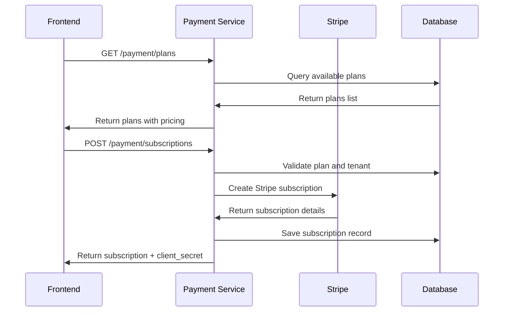
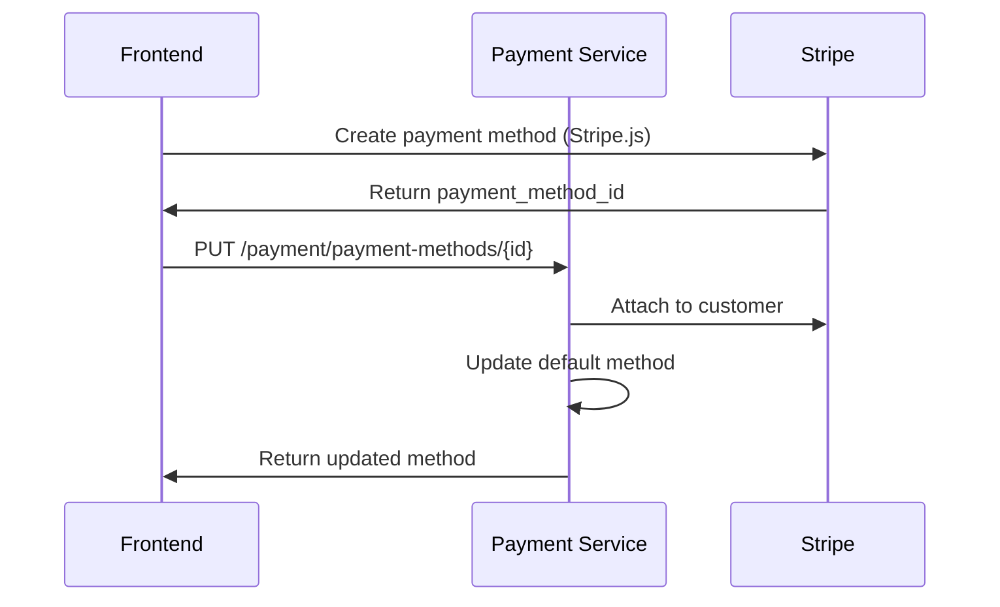
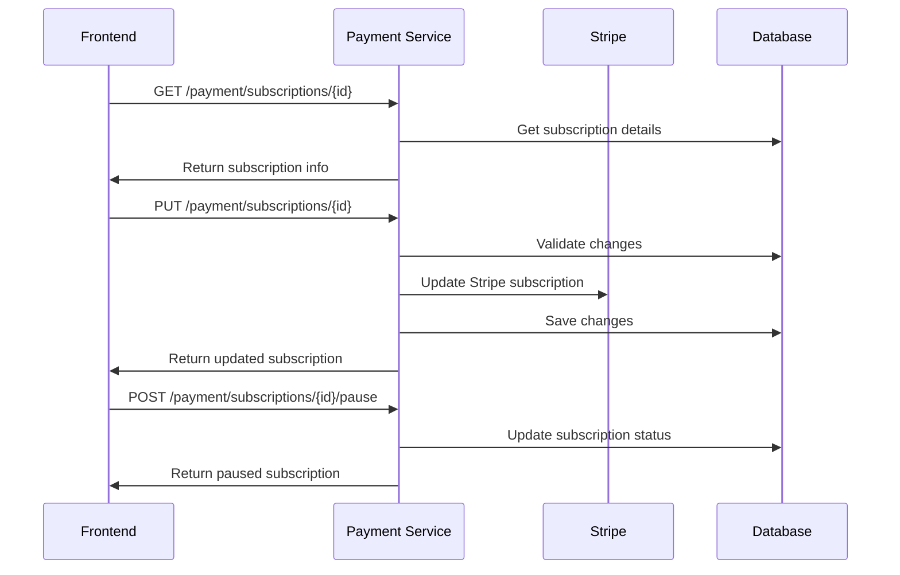
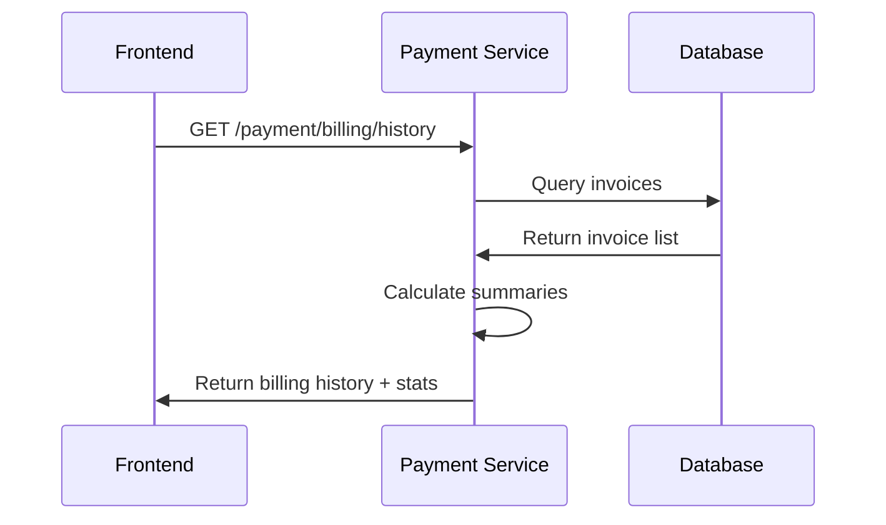

# 💳 Payment Service - Frontend Integration Guide

## 📋 **Table of Contents**
1. [Service Overview](#service-overview)
2. [Base Configuration](#base-configuration)
3. [Payment Management Flows](#payment-management-flows)
4. [API Endpoints Reference](#api-endpoints-reference)
5. [Error Handling](#error-handling)
6. [Security Best Practices](#security-best-practices)
7. [Code Examples](#code-examples)
8. [Testing](#testing)

---

## 🏗️ **Service Overview**

### **Base URL**
```
Production: https://f8u12wibf9.execute-api.us-east-1.amazonaws.com/dev/payment
Development: https://f8u12wibf9.execute-api.us-east-1.amazonaws.com/dev/payment
```

### **Authentication Method**
- **JWT Bearer Tokens** required for all endpoints
- **Rate Limiting** implemented on all endpoints
- **CORS** enabled for all origins
- **Enterprise-grade security** with audit logging
- **Stripe Integration** for real payment processing

### **Response Format**
All endpoints return standardized JSON responses:

```json
{
  "success": true,
  "data": { /* response data */ },
  "message": "Operation completed successfully",
  "timestamp": "2025-08-13T19:30:00Z"
}
```

Error responses:
```json
{
  "success": false,
  "error": {
    "code": "ERROR_CODE",
    "message": "Human readable error message",
    "details": { /* additional error context */ }
  },
  "timestamp": "2025-08-13T19:30:00Z"
}
```

---

## 🔄 **Payment Management Flows**

### **1. Subscription Creation Flow**


### **2. Payment Method Management Flow**


### **3. Subscription Management Flow**


### **4. Billing History Flow**


---

## 📚 **API Endpoints Reference**

### **🔒 Plan Management Endpoints**

#### **1. List Available Plans**
```http
GET /payment/plans?active_only=true&billing_interval=MONTHLY&limit=10&offset=0
Authorization: Bearer <jwt_token>
```

**Query Parameters:**
- `active_only`: Filter active plans only (default: true)
- `billing_interval`: Filter by interval (MONTHLY, YEARLY)
- `limit`: Items per page (default: 10, max: 100)
- `offset`: Number of items to skip (default: 0)
- `category`: Filter by plan category

**Response:**
```json
{
  "success": true,
  "data": {
    "plans": [
      {
        "plan_id": "plan_free",
        "name": "Free Plan",
        "plan_type": "FREE",
        "status": "ACTIVE",
        "monthly_price": 0.00,
        "yearly_price": 0.00,
        "currency": "USD",
        "display_price": 0.00,
        "display_interval": "month",
        "is_popular": false,
        "savings_percentage": 0,
        "features": [
          "basic_chat",
          "single_agent",
          "email_support"
        ],
        "limits": {
          "max_users": 1,
          "max_agents": 1,
          "max_conversations_per_month": 100,
          "storage_gb": 0.5,
          "api_calls_per_month": 1000
        },
        "trial_days": 0,
        "description": "Perfect for individuals getting started"
      },
      {
        "plan_id": "plan_pro",
        "name": "Pro Plan",
        "plan_type": "PRO",
        "status": "ACTIVE",
        "monthly_price": 29.00,
        "yearly_price": 290.00,
        "currency": "USD",
        "display_price": 29.00,
        "display_interval": "month",
        "is_popular": true,
        "savings_percentage": 16.7,
        "features": [
          "advanced_chat",
          "multiple_agents",
          "priority_support",
          "advanced_analytics",
          "api_access"
        ],
        "limits": {
          "max_users": 5,
          "max_agents": 10,
          "max_conversations_per_month": 10000,
          "storage_gb": 50,
          "api_calls_per_month": 100000
        },
        "trial_days": 14,
        "description": "Great for small teams and growing businesses"
      }
    ],
    "total_count": 3,
    "has_more": false,
    "pagination": {
      "limit": 10,
      "offset": 0,
      "current_page": 1,
      "total_pages": 1
    },
    "filters_applied": {
      "billing_interval": "MONTHLY",
      "active_only": true,
      "category": null
    }
  },
  "message": "Plans retrieved successfully"
}
```

**Rate Limit:** 60 requests/minute
**Required Role:** Any authenticated user

#### **2. Get Plan Details**
```http
GET /payment/plans/{plan_id}
Authorization: Bearer <jwt_token>
```

**Response:**
```json
{
  "success": true,
  "data": {
    "plan": {
      "plan_id": "plan_pro",
      "name": "Pro Plan",
      "plan_type": "PRO",
      "status": "ACTIVE",
      "monthly_price": 29.00,
      "yearly_price": 290.00,
      "currency": "USD",
      "is_popular": true,
      "savings_percentage": 16.7,
      "monthly_display": {
        "price": 29.00,
        "interval": "month",
        "currency": "USD"
      },
      "yearly_display": {
        "price": 290.00,
        "interval": "year",
        "currency": "USD",
        "savings_percentage": 16.7
      },
      "feature_details": {
        "included_features": [
          "advanced_chat",
          "multiple_agents",
          "priority_support"
        ],
        "limits": {
          "max_users": 5,
          "max_agents": 10,
          "storage_gb": 50
        },
        "trial_period_days": 14
      }
    }
  },
  "message": "Plan details retrieved successfully"
}
```

**Rate Limit:** 60 requests/minute
**Error Codes:** `PLAN_NOT_FOUND` (404)

---

### **🔒 Subscription Management Endpoints**

#### **3. Create Subscription**
```http
POST /payment/subscriptions
Authorization: Bearer <jwt_token>
Content-Type: application/json

{
  "plan_id": "plan_pro",
  "billing_interval": "MONTHLY"
}
```

**Request Body:**
- `plan_id`: Required, valid plan identifier
- `billing_interval`: Required, "MONTHLY" or "YEARLY"

**Response:**
```json
{
  "success": true,
  "data": {
    "subscription": {
      "subscription_id": "sub_abc123def456",
      "tenant_id": "tnt_xyz789",
      "plan_id": "plan_pro",
      "status": "TRIAL",
      "billing_interval": "MONTHLY",
      "amount": 29.00,
      "currency": "USD",
      "trial_ends_at": 1693747200,
      "current_period_start": 1692537600,
      "current_period_end": 1695129600,
      "next_billing_date": 1693747200,
      "created_at": 1692537600
    },
    "plan": {
      "plan_id": "plan_pro",
      "name": "Pro Plan",
      "monthly_price": 29.00,
      "currency": "USD",
      "trial_days": 14
    },
    "stripe_client_secret": null
  },
  "message": "Subscription created successfully"
}
```

**Rate Limit:** 10 requests/minute
**Error Codes:** 
- `PLAN_NOT_FOUND` (404)
- `SUBSCRIPTION_EXISTS` (409)
- `PLAN_INACTIVE` (422)

#### **4. Get Subscription Details**
```http
GET /payment/subscriptions/{subscription_id}
Authorization: Bearer <jwt_token>
```

**Response:**
```json
{
  "success": true,
  "data": {
    "subscription": {
      "subscription_id": "sub_abc123def456",
      "tenant_id": "tnt_xyz789",
      "plan_id": "plan_pro",
      "status": "ACTIVE",
      "billing_interval": "MONTHLY",
      "amount": 29.00,
      "currency": "USD",
      "current_period_start": 1692537600,
      "current_period_end": 1695129600,
      "next_billing_date": 1695129600,
      "created_at": 1692537600
    },
    "plan": {
      "plan_id": "plan_pro",
      "name": "Pro Plan",
      "status": "ACTIVE"
    },
    "billing_details": {
      "next_billing_date": 1695129600,
      "amount_due": 29.00,
      "currency": "USD",
      "billing_interval": "MONTHLY"
    },
    "usage_stats": {
      "api_calls_used": 0,
      "api_calls_limit": 100000,
      "storage_used_gb": 0,
      "storage_limit_gb": 50
    },
    "tenant_id": "tnt_xyz789"
  },
  "message": "Subscription retrieved successfully"
}
```

**Rate Limit:** 60 requests/minute
**Error Codes:** `SUBSCRIPTION_NOT_FOUND` (404)

#### **5. Update Subscription**
```http
PUT /payment/subscriptions/{subscription_id}
Authorization: Bearer <jwt_token>
Content-Type: application/json

{
  "plan_id": "plan_enterprise",
  "billing_interval": "YEARLY",
  "prorate": true,
  "effective_date": "immediate"
}
```

**Request Body:**
- `plan_id`: Optional, new plan ID
- `billing_interval`: Optional, new billing interval
- `prorate`: Optional, apply proration (default: false)
- `effective_date`: Optional, when to apply changes

**Response:**
```json
{
  "success": true,
  "data": {
    "subscription": {
      "subscription_id": "sub_abc123def456",
      "plan_id": "plan_enterprise",
      "billing_interval": "YEARLY",
      "amount": 2990.00,
      "updated_at": 1692537600
    },
    "changes": {
      "previous_plan_id": "plan_pro",
      "previous_billing_interval": "MONTHLY",
      "new_plan_id": "plan_enterprise",
      "new_billing_interval": "YEARLY",
      "changes_made": ["plan_id", "billing_interval"]
    },
    "billing_info": {
      "next_billing_date": 1695129600,
      "amount_due": 2990.00,
      "currency": "USD",
      "billing_interval": "YEARLY"
    },
    "requires_payment_confirmation": false
  },
  "message": "Subscription updated successfully"
}
```

**Rate Limit:** 20 requests/minute
**Error Codes:** 
- `SUBSCRIPTION_NOT_FOUND` (404)
- `PLAN_NOT_FOUND` (404)
- `INVALID_PLAN_CHANGE` (422)

#### **6. Cancel Subscription**
```http
POST /payment/subscriptions/{subscription_id}/cancel
Authorization: Bearer <jwt_token>
Content-Type: application/json

{
  "at_period_end": true,
  "immediate": false,
  "reason": "No longer needed"
}
```

**Request Body:**
- `at_period_end`: Cancel at end of billing period (default: true)
- `immediate`: Cancel immediately (default: false)
- `reason`: Optional cancellation reason

**Response:**
```json
{
  "success": true,
  "data": {
    "subscription": {
      "subscription_id": "sub_abc123def456",
      "status": "ACTIVE",
      "cancelled_at": null,
      "effective_cancellation_date": 1695129600
    },
    "effective_date": 1695129600,
    "refund_amount": 0.0,
    "cancelled_immediately": false,
    "cancelled_at_period_end": true,
    "cancellation_details": {
      "reason": "No longer needed",
      "cancelled_at": null,
      "cancel_at_period_end": true,
      "effective_cancellation_date": 1695129600,
      "refund_amount": 0.0
    }
  },
  "message": "Subscription cancelled successfully"
}
```

**Rate Limit:** 10 requests/minute

#### **7. Pause Subscription**
```http
POST /payment/subscriptions/{subscription_id}/pause
Authorization: Bearer <jwt_token>
Content-Type: application/json

{
  "pause_duration_days": 30,
  "reason": "Temporary business closure"
}
```

**Request Body:**
- `pause_duration_days`: Required, number of days to pause
- `reason`: Optional pause reason
- `resume_date`: Optional specific resume date (ISO format)

**Response:**
```json
{
  "success": true,
  "data": {
    "subscription": {
      "subscription_id": "sub_abc123def456",
      "status": "PAUSED",
      "paused_at": 1692537600,
      "next_billing_date": 1695129600
    },
    "pause_details": {
      "paused_at": 1692537600,
      "resume_date": 1695129600,
      "pause_duration_days": 30,
      "reason": "Temporary business closure",
      "automatic_resume": true
    },
    "billing_impact": {
      "billing_paused": true,
      "next_billing_date": 1695129600,
      "prorated_amount": 0.00,
      "currency": "USD"
    },
    "resume_date": 1695129600
  },
  "message": "Subscription paused successfully"
}
```

**Rate Limit:** 10 requests/minute

#### **8. Resume Subscription**
```http
POST /payment/subscriptions/{subscription_id}/resume
Authorization: Bearer <jwt_token>
Content-Type: application/json

{
  "immediate": true,
  "reason": "Business operations resumed"
}
```

**Request Body:**
- `immediate`: Resume immediately (default: true)
- `reason`: Optional resume reason

**Response:**
```json
{
  "success": true,
  "data": {
    "subscription": {
      "subscription_id": "sub_abc123def456",
      "status": "ACTIVE",
      "paused_at": null,
      "next_billing_date": 1695129600
    },
    "resume_details": {
      "resumed_at": 1692537600,
      "immediate": true,
      "reason": "Business operations resumed",
      "previous_status": "PAUSED"
    },
    "billing_info": {
      "billing_resumed": true,
      "next_billing_date": 1695129600,
      "amount_due": 29.00,
      "currency": "USD",
      "prorated_amount": 0.00
    },
    "immediate": true,
    "resume_date": 1692537600
  },
  "message": "Subscription resumed successfully"
}
```

**Rate Limit:** 10 requests/minute

---

### **🔒 Billing & Invoice Endpoints**

#### **9. Get Billing History**
```http
GET /payment/billing/history?limit=20&starting_after=inv_123&status=paid&date_from=2025-01-01&date_to=2025-12-31
Authorization: Bearer <jwt_token>
```

**Query Parameters:**
- `limit`: Items per page (default: 20, max: 100)
- `starting_after`: Pagination cursor (invoice ID)
- `status`: Filter by status (paid, open, draft, void)
- `date_from`: Start date filter (ISO format)
- `date_to`: End date filter (ISO format)
- `invoice_type`: Filter by type (subscription, one_time, usage)

**Response:**
```json
{
  "success": true,
  "data": {
    "invoices": [
      {
        "invoice_id": "inv_abc123def456",
        "invoice_number": "INV-2025-1001",
        "tenant_id": "tnt_xyz789",
        "subscription_id": "sub_abc123def456",
        "status": "paid",
        "invoice_type": "subscription",
        "amount_due": 29.00,
        "amount_paid": 29.00,
        "amount_remaining": 0.00,
        "subtotal": 29.00,
        "tax_amount": 0.00,
        "currency": "USD",
        "created_at": 1692537600,
        "due_date": 1692624000,
        "paid_at": 1692610800,
        "period_start": 1692537600,
        "period_end": 1695129600,
        "description": "Pro Plan - Monthly Subscription",
        "line_items": [
          {
            "description": "Pro Plan (Aug 2025)",
            "amount": 29.00,
            "quantity": 1,
            "period": {
              "start": 1692537600,
              "end": 1695129600
            }
          }
        ]
      }
    ],
    "total_count": 12,
    "has_more": false,
    "summary": {
      "total_invoices": 12,
      "total_amount": 348.00,
      "total_paid": 348.00,
      "total_outstanding": 0.00,
      "status_breakdown": {
        "paid": 12,
        "open": 0,
        "draft": 0,
        "void": 0
      },
      "currency": "USD"
    },
    "pagination": {
      "limit": 20,
      "starting_after": null,
      "has_more": false
    },
    "filters_applied": {
      "status": "paid",
      "date_from": "2025-01-01",
      "date_to": "2025-12-31",
      "invoice_type": null
    }
  },
  "message": "Billing history retrieved successfully"
}
```

**Rate Limit:** 60 requests/minute

---

### **🔒 Payment Method Endpoints**

#### **10. Update Payment Method**
```http
PUT /payment/payment-methods/{payment_method_id}
Authorization: Bearer <jwt_token>
Content-Type: application/json

{
  "billing_address": {
    "line1": "123 Main St",
    "city": "New York",
    "state": "NY",
    "postal_code": "10001",
    "country": "US"
  },
  "metadata": {
    "nickname": "Primary Card"
  },
  "set_as_default": true
}
```

**Request Body:**
- `billing_address`: Optional billing address object
- `metadata`: Optional metadata object
- `set_as_default`: Optional, set as default payment method

**Response:**
```json
{
  "success": true,
  "data": {
    "payment_method": {
      "payment_method_id": "pm_abc123def456",
      "tenant_id": "tnt_xyz789",
      "payment_method_type": "card",
      "status": "active",
      "is_default": true,
      "card_brand": "visa",
      "card_last4": "4242",
      "card_exp_month": 12,
      "card_exp_year": 2025,
      "billing_address": {
        "line1": "123 Main St",
        "city": "New York",
        "state": "NY",
        "postal_code": "10001",
        "country": "US"
      },
      "metadata": {
        "nickname": "Primary Card"
      },
      "updated_at": 1692537600
    },
    "changes_applied": [
      "billing_address",
      "metadata",
      "set_as_default"
    ],
    "is_default": true,
    "updated_at": 1692537600
  },
  "message": "Payment method updated successfully"
}
```

**Rate Limit:** 30 requests/minute
**Error Codes:** `PAYMENT_METHOD_NOT_FOUND` (404)

---

## ⚠️ **Error Handling**

### **Common Error Codes**

| Code | HTTP Status | Description | Action |
|------|-------------|-------------|---------|
| `VALIDATION_ERROR` | 422 | Invalid request data | Fix request format |
| `SUBSCRIPTION_NOT_FOUND` | 404 | Subscription doesn't exist | Verify subscription ID |
| `PLAN_NOT_FOUND` | 404 | Plan doesn't exist | Verify plan ID |
| `UNAUTHORIZED` | 401 | Invalid/missing token | Re-authenticate |
| `FORBIDDEN` | 403 | Insufficient permissions | Check user role |
| `RATE_LIMIT_EXCEEDED` | 429 | Too many requests | Wait and retry |
| `SUBSCRIPTION_EXISTS` | 409 | Active subscription exists | Cancel existing first |
| `PLAN_INACTIVE` | 422 | Plan not available | Choose active plan |
| `PAYMENT_REQUIRED` | 402 | Payment method required | Add payment method |
| `STRIPE_ERROR` | 502 | Stripe API error | Retry or contact support |
| `INTERNAL_ERROR` | 500 | Server error | Contact support |

### **Error Response Format**
```json
{
  "success": false,
  "error": {
    "code": "VALIDATION_ERROR",
    "message": "Plan ID is required",
    "details": {
      "field": "plan_id",
      "constraint": "required",
      "provided_value": null
    }
  },
  "timestamp": "2025-08-13T19:30:00Z"
}
```

### **Frontend Error Handling Example**
```javascript
try {
  const response = await paymentAPI.post('/subscriptions', subscriptionData);
  
  if (!response.success) {
    switch (response.error.code) {
      case 'SUBSCRIPTION_EXISTS':
        showError('You already have an active subscription');
        redirectTo('/billing/current');
        break;
      case 'PLAN_NOT_FOUND':
        showError('Selected plan is no longer available');
        refreshPlans();
        break;
      case 'PAYMENT_REQUIRED':
        showError('Please add a payment method first');
        redirectTo('/billing/payment-methods');
        break;
      default:
        showError(response.error.message);
    }
    return;
  }
  
  // Handle success
  showSuccess('Subscription created successfully!');
  updateSubscriptionUI(response.data);
  
} catch (error) {
  console.error('Payment API error:', error);
  showError('Connection error. Please try again.');
}
```

---

## 🔒 **Security Best Practices**

### **1. Authentication & Authorization**
```javascript
// Always include JWT token
const headers = {
  'Authorization': `Bearer ${localStorage.getItem('jwt_token')}`,
  'Content-Type': 'application/json'
};

// Check token expiration before payment operations
function isTokenExpired(token) {
  const payload = JSON.parse(atob(token.split('.')[1]));
  return Date.now() >= payload.exp * 1000;
}

// Refresh token if needed before critical operations
if (isTokenExpired(token)) {
  await refreshToken();
}
```

### **2. Stripe Integration Security**
```javascript
// Use Stripe.js for secure payment method creation
const stripe = Stripe('pk_test_your_publishable_key');

// Create payment method securely on client side
const {paymentMethod, error} = await stripe.createPaymentMethod({
  type: 'card',
  card: cardElement,
  billing_details: {
    name: customerName,
    email: customerEmail,
    address: billingAddress
  }
});

if (error) {
  console.error('Stripe error:', error);
  return;
}

// Send only payment method ID to your backend
await paymentAPI.put(`/payment-methods/${paymentMethod.id}`, {
  set_as_default: true
});
```

### **3. Input Validation**
```javascript
// Validate plan selection
function validatePlanSelection(planId) {
  const validPlans = ['plan_free', 'plan_pro', 'plan_enterprise'];
  if (!validPlans.includes(planId)) {
    throw new Error('Invalid plan selection');
  }
  return planId;
}

// Validate billing interval
function validateBillingInterval(interval) {
  const validIntervals = ['MONTHLY', 'YEARLY'];
  if (!validIntervals.includes(interval)) {
    throw new Error('Invalid billing interval');
  }
  return interval;
}

// Validate subscription data before sending
function validateSubscriptionData(data) {
  return {
    plan_id: validatePlanSelection(data.plan_id),
    billing_interval: validateBillingInterval(data.billing_interval)
  };
}
```

### **4. Rate Limiting Handling**
```javascript
class PaymentRateLimitHandler {
  constructor() {
    this.retryDelays = [1000, 2000, 4000, 8000]; // Exponential backoff
  }

  async makeRequest(url, options, retryCount = 0) {
    try {
      const response = await fetch(url, options);

      if (response.status === 429) {
        const retryAfter = response.headers.get('Retry-After');
        const delay = retryAfter ? parseInt(retryAfter) * 1000 : this.retryDelays[retryCount];

        if (retryCount < this.retryDelays.length) {
          await this.delay(delay);
          return this.makeRequest(url, options, retryCount + 1);
        }
        throw new Error('Rate limit exceeded - please try again later');
      }

      return response;
    } catch (error) {
      throw error;
    }
  }

  delay(ms) {
    return new Promise(resolve => setTimeout(resolve, ms));
  }
}
```

### **5. Secure Data Storage**
```javascript
// Store payment-related data securely
class SecurePaymentStorage {
  static setSubscriptionData(data) {
    // Store non-sensitive subscription info
    const safeData = {
      subscription_id: data.subscription_id,
      plan_id: data.plan_id,
      status: data.status,
      billing_interval: data.billing_interval
    };
    sessionStorage.setItem('subscription_data', JSON.stringify(safeData));
  }

  static getSubscriptionData() {
    const data = sessionStorage.getItem('subscription_data');
    return data ? JSON.parse(data) : null;
  }

  static clearPaymentData() {
    sessionStorage.removeItem('subscription_data');
    sessionStorage.removeItem('billing_data');
    // Never store payment method details locally
  }
}
```

---

## 💻 **Code Examples**

### **1. Complete Payment Service Client**
```javascript
class PaymentAPIClient {
  constructor(baseURL) {
    this.baseURL = baseURL;
    this.rateLimitHandler = new PaymentRateLimitHandler();
  }

  async request(endpoint, options = {}) {
    const url = `${this.baseURL}${endpoint}`;
    const token = localStorage.getItem('jwt_token');

    if (!token) {
      throw new PaymentError('UNAUTHORIZED', 'Authentication required');
    }

    const defaultOptions = {
      headers: {
        'Content-Type': 'application/json',
        'Authorization': `Bearer ${token}`
      }
    };

    const finalOptions = {
      ...defaultOptions,
      ...options,
      headers: {
        ...defaultOptions.headers,
        ...options.headers
      }
    };

    try {
      const response = await this.rateLimitHandler.makeRequest(url, finalOptions);
      const data = await response.json();

      if (!data.success) {
        throw new PaymentError(data.error.code, data.error.message, data.error.details);
      }

      return data;

    } catch (error) {
      if (error instanceof PaymentError) {
        throw error;
      }
      throw new PaymentError('NETWORK_ERROR', 'Network request failed', { originalError: error.message });
    }
  }

  // Convenience methods
  get(endpoint, params = {}) {
    const queryString = new URLSearchParams(params).toString();
    const url = queryString ? `${endpoint}?${queryString}` : endpoint;
    return this.request(url, { method: 'GET' });
  }

  post(endpoint, data) {
    return this.request(endpoint, {
      method: 'POST',
      body: JSON.stringify(data)
    });
  }

  put(endpoint, data) {
    return this.request(endpoint, {
      method: 'PUT',
      body: JSON.stringify(data)
    });
  }
}

class PaymentError extends Error {
  constructor(code, message, details = {}) {
    super(message);
    this.name = 'PaymentError';
    this.code = code;
    this.details = details;
  }
}
```

### **2. Subscription Management Component**
```javascript
class SubscriptionManager {
  constructor(apiClient, stripeClient) {
    this.api = apiClient;
    this.stripe = stripeClient;
  }

  async loadPlans(billingInterval = 'MONTHLY') {
    try {
      const response = await this.api.get('/plans', {
        active_only: true,
        billing_interval: billingInterval,
        limit: 10
      });

      this.renderPlans(response.data.plans, billingInterval);
      return response.data.plans;

    } catch (error) {
      console.error('Failed to load plans:', error);
      this.showError('Failed to load subscription plans');
    }
  }

  async createSubscription(planId, billingInterval) {
    try {
      this.showLoading('Creating subscription...');

      const subscriptionData = validateSubscriptionData({
        plan_id: planId,
        billing_interval: billingInterval
      });

      const response = await this.api.post('/subscriptions', subscriptionData);

      this.hideLoading();
      this.showSuccess('Subscription created successfully!');

      // Update UI with new subscription
      this.updateSubscriptionUI(response.data);

      // Store subscription data
      SecurePaymentStorage.setSubscriptionData(response.data.subscription);

      return response.data;

    } catch (error) {
      this.hideLoading();

      if (error.code === 'SUBSCRIPTION_EXISTS') {
        this.showError('You already have an active subscription');
        this.redirectTo('/billing/current');
      } else if (error.code === 'PAYMENT_REQUIRED') {
        this.showError('Please add a payment method first');
        this.redirectTo('/billing/payment-methods');
      } else {
        this.showError(error.message);
      }

      throw error;
    }
  }

  async updateSubscription(subscriptionId, changes) {
    try {
      this.showLoading('Updating subscription...');

      const response = await this.api.put(`/subscriptions/${subscriptionId}`, changes);

      this.hideLoading();
      this.showSuccess('Subscription updated successfully!');

      // Update UI
      this.updateSubscriptionUI(response.data);

      // Show changes summary
      this.showChangeSummary(response.data.changes);

      return response.data;

    } catch (error) {
      this.hideLoading();
      this.showError(error.message);
      throw error;
    }
  }

  async pauseSubscription(subscriptionId, pauseDays, reason) {
    try {
      const response = await this.api.post(`/subscriptions/${subscriptionId}/pause`, {
        pause_duration_days: pauseDays,
        reason: reason
      });

      this.showSuccess(`Subscription paused for ${pauseDays} days`);
      this.updateSubscriptionUI(response.data);

      return response.data;

    } catch (error) {
      this.showError(error.message);
      throw error;
    }
  }

  async resumeSubscription(subscriptionId, reason) {
    try {
      const response = await this.api.post(`/subscriptions/${subscriptionId}/resume`, {
        immediate: true,
        reason: reason
      });

      this.showSuccess('Subscription resumed successfully!');
      this.updateSubscriptionUI(response.data);

      return response.data;

    } catch (error) {
      this.showError(error.message);
      throw error;
    }
  }

  async cancelSubscription(subscriptionId, immediate = false, reason) {
    try {
      const confirmMessage = immediate
        ? 'Are you sure you want to cancel your subscription immediately? This action cannot be undone.'
        : 'Are you sure you want to cancel your subscription at the end of the billing period?';

      if (!confirm(confirmMessage)) {
        return;
      }

      const response = await this.api.post(`/subscriptions/${subscriptionId}/cancel`, {
        immediate: immediate,
        at_period_end: !immediate,
        reason: reason
      });

      const message = immediate
        ? 'Subscription cancelled immediately'
        : 'Subscription will be cancelled at the end of the billing period';

      this.showSuccess(message);
      this.updateSubscriptionUI(response.data);

      return response.data;

    } catch (error) {
      this.showError(error.message);
      throw error;
    }
  }

  renderPlans(plans, selectedInterval) {
    const plansContainer = document.getElementById('plans-container');
    plansContainer.innerHTML = '';

    plans.forEach(plan => {
      const planElement = this.createPlanElement(plan, selectedInterval);
      plansContainer.appendChild(planElement);
    });
  }

  createPlanElement(plan, interval) {
    const isYearly = interval === 'YEARLY';
    const price = isYearly ? plan.yearly_price : plan.monthly_price;
    const priceText = isYearly ? `$${price}/year` : `$${price}/month`;
    const savings = isYearly && plan.savings_percentage > 0
      ? `<span class="savings">Save ${plan.savings_percentage}%</span>`
      : '';

    const planHTML = `
      <div class="plan-card ${plan.is_popular ? 'popular' : ''}" data-plan-id="${plan.plan_id}">
        ${plan.is_popular ? '<div class="popular-badge">Most Popular</div>' : ''}
        <h3>${plan.name}</h3>
        <div class="price">
          ${priceText}
          ${savings}
        </div>
        <p class="description">${plan.description}</p>
        <ul class="features">
          ${plan.features.map(feature => `<li>${this.formatFeature(feature)}</li>`).join('')}
        </ul>
        <div class="limits">
          <small>
            ${plan.limits.max_users} users •
            ${plan.limits.storage_gb} GB storage •
            ${plan.limits.api_calls_per_month.toLocaleString()} API calls/month
          </small>
        </div>
        <button class="select-plan-btn" onclick="selectPlan('${plan.plan_id}', '${interval}')">
          Select Plan
        </button>
      </div>
    `;

    const planElement = document.createElement('div');
    planElement.innerHTML = planHTML;
    return planElement.firstElementChild;
  }

  formatFeature(feature) {
    const featureMap = {
      'basic_chat': 'Basic Chat Support',
      'advanced_chat': 'Advanced Chat Features',
      'single_agent': 'Single AI Agent',
      'multiple_agents': 'Multiple AI Agents',
      'email_support': 'Email Support',
      'priority_support': 'Priority Support',
      'advanced_analytics': 'Advanced Analytics',
      'api_access': 'API Access',
      'custom_branding': 'Custom Branding'
    };

    return featureMap[feature] || feature.replace(/_/g, ' ').replace(/\b\w/g, l => l.toUpperCase());
  }

  updateSubscriptionUI(subscriptionData) {
    // Update subscription status
    const statusElement = document.getElementById('subscription-status');
    if (statusElement) {
      statusElement.textContent = subscriptionData.subscription.status;
      statusElement.className = `status ${subscriptionData.subscription.status.toLowerCase()}`;
    }

    // Update plan information
    const planElement = document.getElementById('current-plan');
    if (planElement && subscriptionData.plan) {
      planElement.textContent = subscriptionData.plan.name;
    }

    // Update billing information
    const billingElement = document.getElementById('billing-info');
    if (billingElement && subscriptionData.billing_details) {
      const nextBilling = new Date(subscriptionData.billing_details.next_billing_date * 1000);
      billingElement.textContent = `Next billing: ${nextBilling.toLocaleDateString()}`;
    }

    // Emit event for other components
    window.dispatchEvent(new CustomEvent('subscriptionUpdated', {
      detail: subscriptionData
    }));
  }

  showChangeSummary(changes) {
    const changesText = changes.changes_made.map(change => {
      switch (change) {
        case 'plan_id':
          return `Plan changed from ${changes.previous_plan_id} to ${changes.new_plan_id}`;
        case 'billing_interval':
          return `Billing changed from ${changes.previous_billing_interval} to ${changes.new_billing_interval}`;
        default:
          return `${change} updated`;
      }
    }).join(', ');

    this.showInfo(`Changes applied: ${changesText}`);
  }

  // UI Helper methods
  showLoading(message) {
    // Implementation depends on your UI framework
    console.log('Loading:', message);
  }

  hideLoading() {
    // Implementation depends on your UI framework
    console.log('Loading complete');
  }

  showSuccess(message) {
    // Implementation depends on your UI framework
    console.log('Success:', message);
  }

  showError(message) {
    // Implementation depends on your UI framework
    console.error('Error:', message);
  }

  showInfo(message) {
    // Implementation depends on your UI framework
    console.info('Info:', message);
  }

  redirectTo(path) {
    window.location.href = path;
  }
}
```

### **3. Billing History Component**
```javascript
class BillingHistory {
  constructor(apiClient) {
    this.api = apiClient;
    this.currentPage = 1;
    this.filters = {
      status: 'all',
      date_from: null,
      date_to: null
    };
  }

  async loadBillingHistory(page = 1) {
    try {
      this.showLoading();

      const params = {
        limit: 20,
        ...this.filters
      };

      if (page > 1 && this.lastInvoiceId) {
        params.starting_after = this.lastInvoiceId;
      }

      const response = await this.api.get('/billing/history', params);

      this.hideLoading();

      if (page === 1) {
        this.renderBillingHistory(response.data);
      } else {
        this.appendBillingHistory(response.data);
      }

      this.renderSummary(response.data.summary);
      this.updatePagination(response.data);

      return response.data;

    } catch (error) {
      this.hideLoading();
      this.showError('Failed to load billing history');
      console.error('Billing history error:', error);
    }
  }

  async applyFilters(filters) {
    this.filters = { ...this.filters, ...filters };
    this.currentPage = 1;
    this.lastInvoiceId = null;

    await this.loadBillingHistory(1);
  }

  async downloadInvoice(invoiceId) {
    try {
      const response = await this.api.get(`/billing/invoices/${invoiceId}/download`);

      // Create download link
      const link = document.createElement('a');
      link.href = response.data.download_url;
      link.download = `invoice-${invoiceId}.pdf`;
      link.click();

    } catch (error) {
      this.showError('Failed to download invoice');
      console.error('Download error:', error);
    }
  }

  renderBillingHistory(data) {
    const container = document.getElementById('billing-history-container');
    container.innerHTML = '';

    if (data.invoices.length === 0) {
      container.innerHTML = '<p class="no-invoices">No invoices found</p>';
      return;
    }

    const table = document.createElement('table');
    table.className = 'billing-table';
    table.innerHTML = `
      <thead>
        <tr>
          <th>Invoice</th>
          <th>Date</th>
          <th>Description</th>
          <th>Amount</th>
          <th>Status</th>
          <th>Actions</th>
        </tr>
      </thead>
      <tbody>
        ${data.invoices.map(invoice => this.createInvoiceRow(invoice)).join('')}
      </tbody>
    `;

    container.appendChild(table);
  }

  createInvoiceRow(invoice) {
    const date = new Date(invoice.created_at * 1000).toLocaleDateString();
    const amount = `$${invoice.amount_due.toFixed(2)} ${invoice.currency}`;
    const statusClass = invoice.status.toLowerCase();

    return `
      <tr class="invoice-row">
        <td>
          <strong>${invoice.invoice_number}</strong>
          <br>
          <small>${invoice.invoice_id}</small>
        </td>
        <td>${date}</td>
        <td>
          ${invoice.description}
          ${invoice.period_start ? `<br><small>Period: ${new Date(invoice.period_start * 1000).toLocaleDateString()} - ${new Date(invoice.period_end * 1000).toLocaleDateString()}</small>` : ''}
        </td>
        <td>${amount}</td>
        <td>
          <span class="status ${statusClass}">${invoice.status}</span>
        </td>
        <td>
          <button onclick="downloadInvoice('${invoice.invoice_id}')" class="download-btn">
            Download
          </button>
        </td>
      </tr>
    `;
  }

  renderSummary(summary) {
    const summaryContainer = document.getElementById('billing-summary');
    if (!summaryContainer) return;

    summaryContainer.innerHTML = `
      <div class="summary-grid">
        <div class="summary-item">
          <h4>Total Invoices</h4>
          <span class="value">${summary.total_invoices}</span>
        </div>
        <div class="summary-item">
          <h4>Total Amount</h4>
          <span class="value">$${summary.total_amount.toFixed(2)}</span>
        </div>
        <div class="summary-item">
          <h4>Total Paid</h4>
          <span class="value">$${summary.total_paid.toFixed(2)}</span>
        </div>
        <div class="summary-item">
          <h4>Outstanding</h4>
          <span class="value ${summary.total_outstanding > 0 ? 'outstanding' : ''}">
            $${summary.total_outstanding.toFixed(2)}
          </span>
        </div>
      </div>
      <div class="status-breakdown">
        <h4>Status Breakdown</h4>
        <div class="status-grid">
          ${Object.entries(summary.status_breakdown).map(([status, count]) =>
            `<span class="status-item ${status}">${status}: ${count}</span>`
          ).join('')}
        </div>
      </div>
    `;
  }

  updatePagination(data) {
    const paginationContainer = document.getElementById('pagination');
    if (!paginationContainer) return;

    const hasMore = data.has_more;
    const currentPage = this.currentPage;

    paginationContainer.innerHTML = `
      <div class="pagination-info">
        Showing ${data.invoices.length} of ${data.total_count} invoices
      </div>
      <div class="pagination-controls">
        ${currentPage > 1 ? '<button onclick="loadPreviousPage()" class="page-btn">Previous</button>' : ''}
        <span class="page-info">Page ${currentPage}</span>
        ${hasMore ? '<button onclick="loadNextPage()" class="page-btn">Next</button>' : ''}
      </div>
    `;

    // Store last invoice ID for pagination
    if (data.invoices.length > 0) {
      this.lastInvoiceId = data.invoices[data.invoices.length - 1].invoice_id;
    }
  }

  // Filter methods
  setupFilters() {
    const statusFilter = document.getElementById('status-filter');
    const dateFromFilter = document.getElementById('date-from-filter');
    const dateToFilter = document.getElementById('date-to-filter');

    if (statusFilter) {
      statusFilter.addEventListener('change', (e) => {
        this.applyFilters({ status: e.target.value });
      });
    }

    if (dateFromFilter) {
      dateFromFilter.addEventListener('change', (e) => {
        this.applyFilters({ date_from: e.target.value });
      });
    }

    if (dateToFilter) {
      dateToFilter.addEventListener('change', (e) => {
        this.applyFilters({ date_to: e.target.value });
      });
    }
  }

  // UI Helper methods
  showLoading() {
    const container = document.getElementById('billing-history-container');
    if (container) {
      container.innerHTML = '<div class="loading">Loading billing history...</div>';
    }
  }

  hideLoading() {
    // Loading will be replaced by actual content
  }

  showError(message) {
    const container = document.getElementById('billing-history-container');
    if (container) {
      container.innerHTML = `<div class="error">${message}</div>`;
    }
  }
}
```

### **4. Payment Method Management**
```javascript
class PaymentMethodManager {
  constructor(apiClient, stripeClient) {
    this.api = apiClient;
    this.stripe = stripeClient;
  }

  async setupPaymentMethod(cardElement, billingDetails) {
    try {
      this.showLoading('Setting up payment method...');

      // Create payment method with Stripe
      const {paymentMethod, error} = await this.stripe.createPaymentMethod({
        type: 'card',
        card: cardElement,
        billing_details: billingDetails
      });

      if (error) {
        throw new Error(error.message);
      }

      // Update payment method in backend
      const response = await this.api.put(`/payment-methods/${paymentMethod.id}`, {
        billing_address: billingDetails.address,
        metadata: {
          nickname: billingDetails.name || 'Primary Card'
        },
        set_as_default: true
      });

      this.hideLoading();
      this.showSuccess('Payment method added successfully!');

      // Update UI
      this.updatePaymentMethodUI(response.data.payment_method);

      return response.data;

    } catch (error) {
      this.hideLoading();
      this.showError(error.message);
      throw error;
    }
  }

  async updatePaymentMethod(paymentMethodId, updates) {
    try {
      const response = await this.api.put(`/payment-methods/${paymentMethodId}`, updates);

      this.showSuccess('Payment method updated successfully!');
      this.updatePaymentMethodUI(response.data.payment_method);

      return response.data;

    } catch (error) {
      this.showError(error.message);
      throw error;
    }
  }

  updatePaymentMethodUI(paymentMethod) {
    const container = document.getElementById('payment-method-info');
    if (!container) return;

    const cardInfo = paymentMethod.card_brand && paymentMethod.card_last4
      ? `${paymentMethod.card_brand.toUpperCase()} •••• ${paymentMethod.card_last4}`
      : 'Payment Method';

    container.innerHTML = `
      <div class="payment-method-card ${paymentMethod.is_default ? 'default' : ''}">
        <div class="card-info">
          <h4>${cardInfo}</h4>
          ${paymentMethod.is_default ? '<span class="default-badge">Default</span>' : ''}
        </div>
        <div class="card-details">
          ${paymentMethod.card_exp_month && paymentMethod.card_exp_year
            ? `<p>Expires: ${paymentMethod.card_exp_month}/${paymentMethod.card_exp_year}</p>`
            : ''
          }
          ${paymentMethod.billing_address && paymentMethod.billing_address.country
            ? `<p>Country: ${paymentMethod.billing_address.country}</p>`
            : ''
          }
        </div>
        <div class="card-actions">
          ${!paymentMethod.is_default
            ? `<button onclick="setAsDefault('${paymentMethod.payment_method_id}')" class="set-default-btn">Set as Default</button>`
            : ''
          }
          <button onclick="editPaymentMethod('${paymentMethod.payment_method_id}')" class="edit-btn">Edit</button>
        </div>
      </div>
    `;
  }

  // UI Helper methods
  showLoading(message) {
    console.log('Loading:', message);
  }

  hideLoading() {
    console.log('Loading complete');
  }

  showSuccess(message) {
    console.log('Success:', message);
  }

  showError(message) {
    console.error('Error:', message);
  }
}
```

---

## 🧪 **Testing**

### **1. Unit Tests for Payment API Client**
```javascript
describe('PaymentAPIClient', () => {
  let client;

  beforeEach(() => {
    client = new PaymentAPIClient('https://api.example.com/payment');
    global.fetch = jest.fn();
    localStorage.setItem('jwt_token', 'mock_token');
  });

  afterEach(() => {
    localStorage.clear();
    jest.clearAllMocks();
  });

  test('should create subscription successfully', async () => {
    const mockResponse = {
      success: true,
      data: {
        subscription: {
          subscription_id: 'sub_123',
          plan_id: 'plan_pro',
          status: 'ACTIVE'
        }
      }
    };

    fetch.mockResolvedValueOnce({
      json: () => Promise.resolve(mockResponse)
    });

    const result = await client.post('/subscriptions', {
      plan_id: 'plan_pro',
      billing_interval: 'MONTHLY'
    });

    expect(result.data.subscription.subscription_id).toBe('sub_123');
    expect(fetch).toHaveBeenCalledWith(
      'https://api.example.com/payment/subscriptions',
      expect.objectContaining({
        method: 'POST',
        headers: expect.objectContaining({
          'Authorization': 'Bearer mock_token'
        }),
        body: JSON.stringify({
          plan_id: 'plan_pro',
          billing_interval: 'MONTHLY'
        })
      })
    );
  });

  test('should handle payment errors', async () => {
    const mockError = {
      success: false,
      error: {
        code: 'SUBSCRIPTION_EXISTS',
        message: 'Active subscription already exists'
      }
    };

    fetch.mockResolvedValueOnce({
      json: () => Promise.resolve(mockError)
    });

    await expect(client.post('/subscriptions', {}))
      .rejects.toThrow('Active subscription already exists');
  });

  test('should handle rate limiting', async () => {
    fetch.mockResolvedValueOnce({
      status: 429,
      headers: new Map([['Retry-After', '2']]),
      json: () => Promise.resolve({
        success: false,
        error: { code: 'RATE_LIMIT_EXCEEDED', message: 'Too many requests' }
      })
    });

    const rateLimitHandler = new PaymentRateLimitHandler();

    await expect(rateLimitHandler.makeRequest('/payment/subscriptions', {}))
      .rejects.toThrow('Rate limit exceeded');
  });
});
```

### **2. Integration Tests**
```javascript
describe('Payment Integration Flow', () => {
  let paymentClient;
  let subscriptionManager;

  beforeEach(() => {
    paymentClient = new PaymentAPIClient('https://api.example.com/payment');
    subscriptionManager = new SubscriptionManager(paymentClient);
  });

  test('complete subscription creation flow', async () => {
    // 1. Load plans
    const plans = await subscriptionManager.loadPlans('MONTHLY');
    expect(plans).toHaveLength(3);

    // 2. Create subscription
    const subscription = await subscriptionManager.createSubscription('plan_pro', 'MONTHLY');
    expect(subscription.data.subscription.plan_id).toBe('plan_pro');

    // 3. Get subscription details
    const details = await paymentClient.get(`/subscriptions/${subscription.data.subscription.subscription_id}`);
    expect(details.data.subscription.status).toBe('ACTIVE');

    // 4. Update subscription
    const updated = await subscriptionManager.updateSubscription(
      subscription.data.subscription.subscription_id,
      { billing_interval: 'YEARLY' }
    );
    expect(updated.data.subscription.billing_interval).toBe('YEARLY');
  });

  test('subscription lifecycle management', async () => {
    const subscriptionId = 'sub_test_123';

    // Pause subscription
    const paused = await subscriptionManager.pauseSubscription(subscriptionId, 30, 'Testing');
    expect(paused.data.subscription.status).toBe('PAUSED');

    // Resume subscription
    const resumed = await subscriptionManager.resumeSubscription(subscriptionId, 'Testing complete');
    expect(resumed.data.subscription.status).toBe('ACTIVE');

    // Cancel subscription
    const cancelled = await subscriptionManager.cancelSubscription(subscriptionId, false, 'End of test');
    expect(cancelled.data.cancelled_at_period_end).toBe(true);
  });
});
```

### **3. Error Handling Tests**
```javascript
describe('Payment Error Handling', () => {
  test('should handle authentication errors', async () => {
    localStorage.removeItem('jwt_token');

    const client = new PaymentAPIClient('https://api.example.com/payment');

    await expect(client.get('/plans'))
      .rejects.toThrow('Authentication required');
  });

  test('should handle validation errors', async () => {
    const client = new PaymentAPIClient('https://api.example.com/payment');

    fetch.mockResolvedValueOnce({
      json: () => Promise.resolve({
        success: false,
        error: {
          code: 'VALIDATION_ERROR',
          message: 'Plan ID is required',
          details: { field: 'plan_id' }
        }
      })
    });

    try {
      await client.post('/subscriptions', {});
    } catch (error) {
      expect(error.code).toBe('VALIDATION_ERROR');
      expect(error.details.field).toBe('plan_id');
    }
  });

  test('should handle Stripe errors', async () => {
    const client = new PaymentAPIClient('https://api.example.com/payment');

    fetch.mockResolvedValueOnce({
      json: () => Promise.resolve({
        success: false,
        error: {
          code: 'STRIPE_ERROR',
          message: 'Your card was declined',
          details: { decline_code: 'generic_decline' }
        }
      })
    });

    try {
      await client.post('/subscriptions', { plan_id: 'plan_pro' });
    } catch (error) {
      expect(error.code).toBe('STRIPE_ERROR');
      expect(error.details.decline_code).toBe('generic_decline');
    }
  });
});
```

### **4. Performance Tests**
```javascript
describe('Payment Performance', () => {
  test('should handle concurrent plan requests', async () => {
    const client = new PaymentAPIClient('https://api.example.com/payment');

    const promises = Array(10).fill().map(() =>
      client.get('/plans')
    );

    const results = await Promise.allSettled(promises);
    const successful = results.filter(r => r.status === 'fulfilled');

    expect(successful.length).toBeGreaterThan(0);
  });

  test('should respect rate limits', async () => {
    const client = new PaymentAPIClient('https://api.example.com/payment');
    const startTime = Date.now();

    // Simulate rate limiting
    fetch.mockImplementation(() =>
      Promise.resolve({
        status: 429,
        headers: new Map([['Retry-After', '1']]),
        json: () => Promise.resolve({
          success: false,
          error: { code: 'RATE_LIMIT_EXCEEDED' }
        })
      })
    );

    try {
      await client.post('/subscriptions', { plan_id: 'plan_pro' });
    } catch (error) {
      const endTime = Date.now();
      const duration = endTime - startTime;

      // Should have waited due to rate limiting
      expect(duration).toBeGreaterThan(1000);
      expect(error.message).toContain('Rate limit exceeded');
    }
  });

  test('should cache plan data appropriately', async () => {
    const client = new PaymentAPIClient('https://api.example.com/payment');

    // First request
    await client.get('/plans');

    // Second request should use cache (if implemented)
    const startTime = Date.now();
    await client.get('/plans');
    const endTime = Date.now();

    // Cache hit should be faster
    expect(endTime - startTime).toBeLessThan(100);
  });
});
```

### **5. Stripe Integration Tests**
```javascript
describe('Stripe Integration', () => {
  let stripe;
  let paymentMethodManager;

  beforeEach(() => {
    stripe = {
      createPaymentMethod: jest.fn(),
      confirmCardPayment: jest.fn()
    };

    paymentMethodManager = new PaymentMethodManager(
      new PaymentAPIClient('https://api.example.com/payment'),
      stripe
    );
  });

  test('should create payment method with Stripe', async () => {
    const mockPaymentMethod = {
      id: 'pm_test_123',
      type: 'card',
      card: {
        brand: 'visa',
        last4: '4242'
      }
    };

    stripe.createPaymentMethod.mockResolvedValueOnce({
      paymentMethod: mockPaymentMethod,
      error: null
    });

    fetch.mockResolvedValueOnce({
      json: () => Promise.resolve({
        success: true,
        data: { payment_method: mockPaymentMethod }
      })
    });

    const cardElement = {}; // Mock card element
    const billingDetails = {
      name: 'John Doe',
      email: 'john@example.com',
      address: {
        line1: '123 Main St',
        city: 'New York',
        state: 'NY',
        postal_code: '10001',
        country: 'US'
      }
    };

    const result = await paymentMethodManager.setupPaymentMethod(cardElement, billingDetails);

    expect(stripe.createPaymentMethod).toHaveBeenCalledWith({
      type: 'card',
      card: cardElement,
      billing_details: billingDetails
    });

    expect(result.data.payment_method.id).toBe('pm_test_123');
  });

  test('should handle Stripe errors', async () => {
    stripe.createPaymentMethod.mockResolvedValueOnce({
      paymentMethod: null,
      error: {
        type: 'card_error',
        code: 'card_declined',
        message: 'Your card was declined.'
      }
    });

    const cardElement = {};
    const billingDetails = { name: 'John Doe' };

    await expect(paymentMethodManager.setupPaymentMethod(cardElement, billingDetails))
      .rejects.toThrow('Your card was declined.');
  });
});
```

---

## 📝 **Summary**

The Payment Service provides comprehensive subscription and billing management functionality with:

- **10 API endpoints** covering all payment operations
- **Real Stripe integration** for secure payment processing
- **Enterprise-grade security** with JWT authentication and audit logging
- **Rate limiting** to prevent abuse and ensure fair usage
- **Comprehensive error handling** with detailed error codes
- **Real-time subscription management** (create, update, pause, resume, cancel)
- **Billing history** with invoice management
- **Payment method management** with Stripe.js integration
- **Usage tracking** and plan limit enforcement

### **Key Integration Points:**
1. **Authentication**: Requires JWT tokens from Auth Service
2. **Tenant Management**: Integrates with Tenant Service for tenant validation
3. **Stripe**: Real payment processing with Stripe API
4. **Database**: Persistent storage in DynamoDB
5. **Audit Logging**: Complete audit trail for compliance

### **Frontend Implementation Checklist:**
- [ ] Implement PaymentAPIClient with rate limiting and error handling
- [ ] Add Stripe.js integration for secure payment method creation
- [ ] Create subscription management UI with plan selection
- [ ] Implement billing history with filtering and pagination
- [ ] Add payment method management interface
- [ ] Create subscription lifecycle management (pause/resume/cancel)
- [ ] Add proper error handling for all payment error codes
- [ ] Implement loading states and progress indicators
- [ ] Add input validation for all payment forms
- [ ] Create responsive UI for all payment flows
- [ ] Add comprehensive testing coverage
- [ ] Implement analytics and conversion tracking
- [ ] Add accessibility features for payment forms
- [ ] Create webhook handling for real-time updates

### **Security Considerations:**
- **Never store payment details** on frontend or in local storage
- **Use Stripe.js** for all payment method creation
- **Validate all inputs** before sending to API
- **Handle rate limiting** gracefully with exponential backoff
- **Implement proper error handling** for all payment scenarios
- **Use HTTPS only** for all payment-related communications
- **Follow PCI compliance** guidelines for payment data handling

### **Testing Strategy:**
- **Unit tests** for all API client methods
- **Integration tests** for complete payment flows
- **Error handling tests** for all error scenarios
- **Performance tests** for rate limiting and concurrent requests
- **Stripe integration tests** for payment method creation
- **End-to-end tests** for complete user journeys
- **Security tests** for authentication and authorization

This guide provides everything needed for a complete, secure, and robust frontend integration with the Payment Service, ensuring a smooth payment experience for users while maintaining the highest security standards.
```
```
