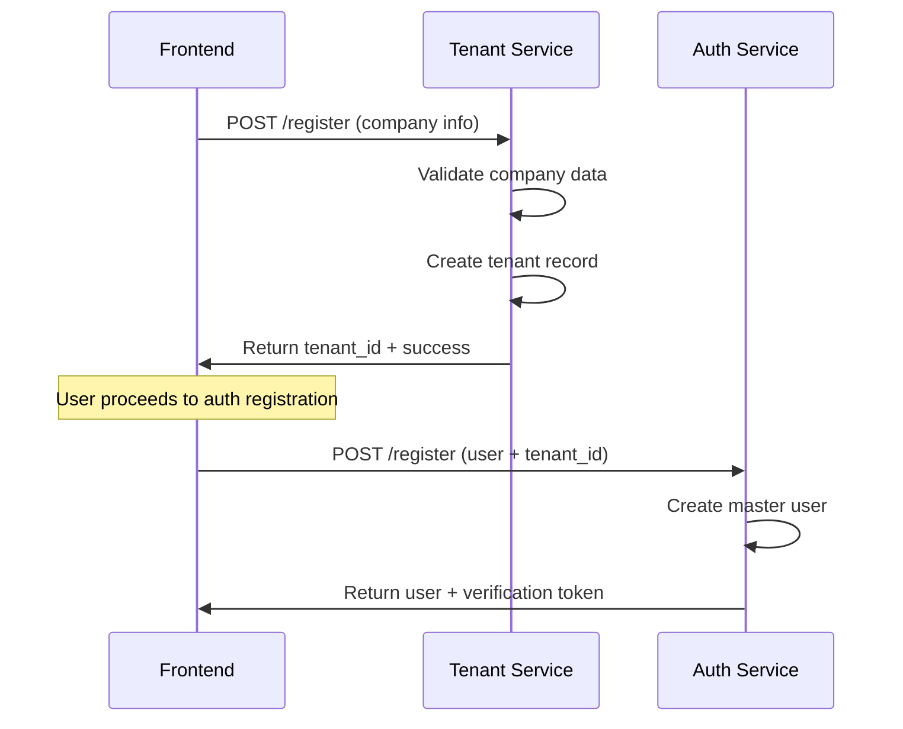
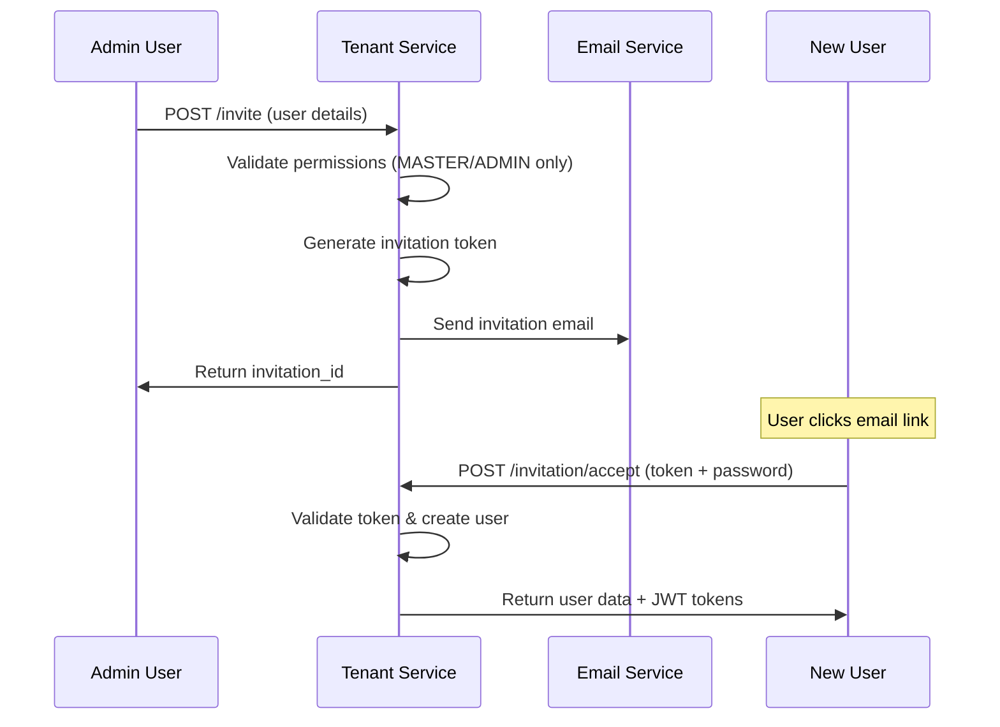
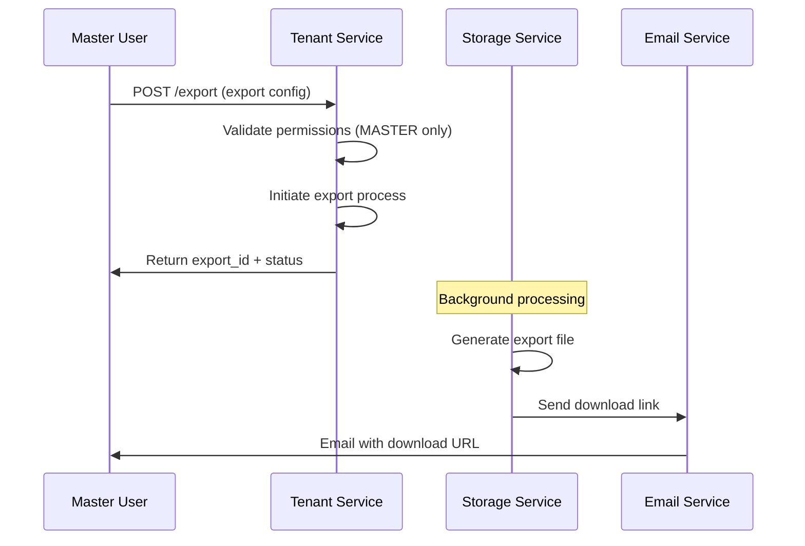

# 🏢 Tenant Service - Frontend Integration Guide

## 📋 **Table of Contents**
1. [Service Overview](#service-overview)
2. [Base Configuration](#base-configuration)
3. [Tenant Management Flows](#tenant-management-flows)
4. [API Endpoints Reference](#api-endpoints-reference)
5. [Error Handling](#error-handling)
6. [Security Best Practices](#security-best-practices)
7. [Code Examples](#code-examples)
8. [Testing](#testing)

---

## 🏗️ **Service Overview**

### **Base URL**
```
Production: https://f8u12wibf9.execute-api.us-east-1.amazonaws.com/dev/tenant
Development: https://f8u12wibf9.execute-api.us-east-1.amazonaws.com/dev/tenant
```

### **Authentication Method**
- **JWT Bearer Tokens** for authenticated endpoints (except registration and invitation acceptance)
- **Rate Limiting** implemented on all endpoints
- **CORS** enabled for all origins
- **Enterprise-grade security** with audit logging

### **Response Format**
All endpoints return standardized JSON responses:

```json
{
  "success": true,
  "data": { /* response data */ },
  "message": "Operation completed successfully",
  "timestamp": "2025-08-13T19:30:00Z"
}
```

Error responses:
```json
{
  "success": false,
  "error": {
    "code": "ERROR_CODE",
    "message": "Human readable error message",
    "details": { /* additional error context */ }
  },
  "timestamp": "2025-08-13T19:30:00Z"
}
```

---

## ⚙️ **Base Configuration**

### **Required Headers**
```javascript
const headers = {
  'Content-Type': 'application/json',
  'Accept': 'application/json'
};

// For authenticated endpoints
const authHeaders = {
  ...headers,
  'Authorization': `Bearer ${accessToken}`
};
```

### **Rate Limits**
| Endpoint Type | Requests per Minute |
|---------------|-------------------|
| Tenant Registration | 5 |
| Profile Operations | 30 |
| Settings Updates | 20 |
| User Invitations | 20 |
| User Listing | 60 |
| Usage Statistics | 100 |
| Data Export | 2 |
| Invitation Acceptance | 20 |
| Tenant Listing (Admin) | 30 |

---

## 🔄 **Tenant Management Flows**

### **1. Tenant Registration Flow**



### **2. User Invitation Flow**



### **3. Data Export Flow (GDPR)**



---

## 📡 **API Endpoints Reference**

### **1. Tenant Registration (No Auth Required)**
```http
POST /register
```

**Request Body:**
```json
{
  "company_name": "Acme Corporation",
  "industry": "logistics",
  "company_size": "medium",
  "country": "Colombia",
  "address": "Calle 123 #45-67",
  "phone": "+57 300 123 4567",
  "website": "https://acme.com"
}
```

**Response:**
```json
{
  "success": true,
  "data": {
    "tenant": {
      "tenant_id": "tnt_acme_20250813_193000",
      "name": "Acme Corporation",
      "industry": "logistics",
      "company_size": "medium",
      "country": "Colombia",
      "address": "Calle 123 #45-67",
      "phone": "+57 300 123 4567",
      "website": "https://acme.com",
      "plan": "FREE",
      "status": "ACTIVE",
      "created_at": "2025-08-13T19:30:00Z"
    },
    "next_steps": [
      "Complete user registration with this tenant_id",
      "Verify your email address",
      "Set up your first users and permissions"
    ]
  },
  "message": "Tenant registered successfully"
}
```

**Validation Rules:**
- Company name: 2-100 characters, unique
- Industry: Optional, predefined list
- Company size: small, medium, large, enterprise
- Country: ISO country codes
- Phone: International format (+country code)
- Website: Valid URL format

### **2. Get User Profile (Auth Required)**
```http
GET /profile
Authorization: Bearer {access_token}
```

**Response:**
```json
{
  "success": true,
  "data": {
    "user": {
      "user_id": "usr_123",
      "email": "admin@acme.com",
      "first_name": "John",
      "last_name": "Doe",
      "phone": "+57 300 123 4567",
      "role": "MASTER",
      "status": "ACTIVE",
      "email_verified": true,
      "created_at": "2025-08-13T19:30:00Z",
      "last_login": "2025-08-13T20:15:00Z"
    },
    "tenant": {
      "tenant_id": "tnt_acme_20250813_193000",
      "name": "Acme Corporation",
      "plan": "FREE",
      "status": "ACTIVE",
      "user_count": 1,
      "created_at": "2025-08-13T19:30:00Z"
    },
    "permissions": {
      "can_invite_users": true,
      "can_manage_settings": true,
      "can_export_data": true,
      "can_view_usage": true,
      "can_manage_billing": true
    }
  },
  "message": "Profile retrieved successfully"
}
```

### **3. Update Tenant Settings (Auth Required)**
```http
PUT /settings
Authorization: Bearer {access_token}
```

**Request Body:**
```json
{
  "company_name": "Acme Corporation Ltd",
  "industry": "logistics",
  "company_size": "large",
  "address": "New Address 456",
  "phone": "+57 300 987 6543",
  "website": "https://newacme.com",
  "timezone": "America/Bogota",
  "language": "es",
  "notifications": {
    "email_notifications": true,
    "security_alerts": true,
    "usage_reports": false
  }
}
```

**Response:**
```json
{
  "success": true,
  "data": {
    "tenant": {
      "tenant_id": "tnt_acme_20250813_193000",
      "name": "Acme Corporation Ltd",
      "industry": "logistics",
      "company_size": "large",
      "address": "New Address 456",
      "phone": "+57 300 987 6543",
      "website": "https://newacme.com",
      "timezone": "America/Bogota",
      "language": "es",
      "updated_at": "2025-08-13T20:30:00Z"
    },
    "settings_updated": [
      "company_name",
      "company_size", 
      "address",
      "phone",
      "website",
      "timezone",
      "notifications"
    ]
  },
  "message": "Tenant settings updated successfully"
}
```

**Permissions Required:** MASTER or ADMIN role

### **4. Invite User (Auth Required)**
```http
POST /invite
Authorization: Bearer {access_token}
```

**Request Body:**
```json
{
  "email": "newuser@acme.com",
  "first_name": "Jane",
  "last_name": "Smith",
  "role": "MEMBER",
  "send_email": true
}
```

**Response:**
```json
{
  "success": true,
  "data": {
    "invitation": {
      "invitation_id": "inv_tnt_acme_20250813_203000_abc123",
      "email": "newuser@acme.com",
      "first_name": "Jane",
      "last_name": "Smith",
      "role": "MEMBER",
      "status": "sent",
      "expires_at": "2025-08-20T20:30:00Z",
      "created_at": "2025-08-13T20:30:00Z",
      "created_by": "usr_123"
    },
    "email_sent": true,
    "invitation_link": "https://app.acme.com/accept-invitation?token=inv_tnt_acme_20250813_203000_abc123"
  },
  "message": "User invitation sent successfully"
}
```

**Permissions Required:** MASTER or ADMIN role
**Validation Rules:**
- Email: Valid format, not already registered
- Role: MEMBER, ADMIN (MASTER can only be created during registration)
- Names: 1-50 characters each

### **5. List Users (Auth Required)**
```http
GET /users?page=1&page_size=20&status=ACTIVE&role=MEMBER
Authorization: Bearer {access_token}
```

**Query Parameters:**
- `page`: Page number (default: 1)
- `page_size`: Items per page (default: 20, max: 100)
- `status`: Filter by status (ACTIVE, INACTIVE, PENDING)
- `role`: Filter by role (MASTER, ADMIN, MEMBER, VIEWER)

**Response:**
```json
{
  "success": true,
  "data": {
    "users": [
      {
        "user_id": "usr_123",
        "email": "admin@acme.com",
        "first_name": "John",
        "last_name": "Doe",
        "role": "MASTER",
        "status": "ACTIVE",
        "created_at": "2025-08-13T19:30:00Z",
        "last_login": "2025-08-13T20:15:00Z",
        "is_current_user": true
      }
    ],
    "pagination": {
      "page": 1,
      "page_size": 20,
      "total_count": 1,
      "total_pages": 1,
      "has_next": false,
      "has_previous": false
    },
    "filters": {
      "status": "ACTIVE",
      "role": null
    },
    "permissions": {
      "can_view_all": true,
      "can_invite_users": true,
      "can_manage_users": true
    }
  },
  "message": "Retrieved 1 of 1 users"
}
```

**Permissions:** All authenticated users (visibility varies by role)

### **6. Get Usage Statistics (Auth Required)**
```http
GET /usage?period=current_month&include_details=true&metric_type=api_calls
Authorization: Bearer {access_token}
```

**Query Parameters:**
- `period`: current_month, last_month, current_year, last_year, last_7_days, last_30_days
- `include_details`: Include detailed breakdown (true/false)
- `metric_type`: Specific metric (api_calls, storage, users, features, bandwidth)

**Response:**
```json
{
  "success": true,
  "data": {
    "usage_statistics": {
      "api_calls": {
        "current_period": 2500,
        "limit": 10000,
        "percentage": 25.0
      },
      "storage": {
        "current_gb": 0.3,
        "limit_gb": 1,
        "percentage": 30.0
      },
      "users": {
        "current_count": 1,
        "limit": 5,
        "percentage": 20.0
      },
      "features": {
        "enabled": ["basic_analytics", "email_support"],
        "total_available": 2
      }
    },
    "plan_limits": {
      "api_calls_per_month": 10000,
      "storage_gb": 1,
      "users": 5,
      "features": ["basic_analytics", "email_support"]
    },
    "warnings": [],
    "period": "current_month",
    "period_start": "2025-08-01T00:00:00Z",
    "period_end": "2025-08-13T19:30:00Z",
    "generated_at": "2025-08-13T19:30:00Z",
    "plan": "FREE"
  },
  "message": "Usage statistics retrieved successfully"
}
```

**Permissions Required:** MASTER or ADMIN role

### **7. Export Data (Auth Required)**
```http
POST /export
Authorization: Bearer {access_token}
```

**Request Body:**
```json
{
  "export_type": "full",
  "format": "json",
  "include_users": true,
  "include_billing": true,
  "include_usage_stats": true,
  "include_settings": true,
  "reason": "GDPR compliance request"
}
```

**Response:**
```json
{
  "success": true,
  "data": {
    "export_id": "exp_tnt_acme_20250813_193000",
    "status": "initiated",
    "estimated_completion": "2025-08-13T20:45:00Z",
    "download_url": null,
    "export_details": {
      "export_type": "full",
      "format": "json",
      "includes": {
        "users": true,
        "billing": true,
        "usage_stats": true,
        "settings": true
      },
      "reason": "GDPR compliance request"
    },
    "instructions": {
      "message": "Export has been initiated. You will receive an email notification when ready.",
      "check_status_endpoint": "/tenant/export/exp_tnt_acme_20250813_193000/status",
      "estimated_size": "Will be calculated during processing"
    }
  },
  "message": "Data export initiated successfully"
}
```

**Permissions Required:** MASTER role only
**Export Types:** full, users_only, settings_only, usage_only, minimal
**Formats:** json, csv, xml

### **8. Accept Invitation (No Auth Required)**
```http
POST /invitation/accept
```

**Request Body:**
```json
{
  "invitation_token": "inv_tnt_acme_20250813_203000_abc123",
  "password": "SecurePassword123!",
  "phone": "+57 300 555 1234",
  "first_name": "Jane",
  "last_name": "Smith"
}
```

**Response:**
```json
{
  "success": true,
  "data": {
    "user": {
      "user_id": "usr_tnt_acme_20250813_203500",
      "email": "newuser@acme.com",
      "first_name": "Jane",
      "last_name": "Smith",
      "phone": "+57 300 555 1234",
      "role": "MEMBER",
      "status": "ACTIVE",
      "tenant_id": "tnt_acme_20250813_193000",
      "created_at": "2025-08-13T20:35:00Z",
      "profile_completed": true
    },
    "invitation_accepted": true,
    "access_token": "eyJhbGciOiJIUzI1NiIsInR5cCI6IkpXVCJ9...",
    "refresh_token": "eyJhbGciOiJIUzI1NiIsInR5cCI6IkpXVCJ9...",
    "next_steps": [
      "Complete your profile if not done",
      "Explore the platform features",
      "Contact your tenant administrator for role-specific training"
    ],
    "welcome_message": "Welcome to Acme Corporation! Your account has been successfully created."
  },
  "message": "Invitation accepted successfully. Your account has been created and you are now logged in."
}
```

**Validation Rules:**
- Token: Must be valid and not expired
- Password: Min 8 chars, uppercase, lowercase, number, special char
- Phone: International format (optional)
- Names: 1-50 characters (optional)

### **9. List All Tenants - Admin Only (Auth Required)**
```http
GET /list?page=1&limit=20&status=active&search=company&plan=PROFESSIONAL
Authorization: Bearer {access_token}
```

**Query Parameters:**
- `page`: Page number (default: 1)
- `limit`: Items per page (default: 20, max: 100)
- `status`: Filter by status (ACTIVE, INACTIVE, SUSPENDED)
- `search`: Search by name or domain
- `plan`: Filter by plan (FREE, PROFESSIONAL, ENTERPRISE)

**Response:**
```json
{
  "success": true,
  "data": {
    "tenants": [
      {
        "tenant_id": "tnt_001",
        "name": "Acme Corporation",
        "domain": "acme.com",
        "plan": "ENTERPRISE",
        "status": "ACTIVE",
        "created_at": "2025-01-01T00:00:00Z",
        "user_count": 45,
        "last_activity": "2025-08-13T18:30:00Z",
        "billing_email": "billing@acme.com"
      }
    ],
    "pagination": {
      "page": 1,
      "limit": 20,
      "total_count": 3,
      "total_pages": 1,
      "has_next": false,
      "has_previous": false
    },
    "filters": {
      "status": "active",
      "search": "company",
      "plan": "PROFESSIONAL"
    },
    "summary": {
      "total_tenants": 3,
      "active_tenants": 3,
      "plans_distribution": {
        "FREE": 1,
        "PROFESSIONAL": 1,
        "ENTERPRISE": 1
      }
    }
  },
  "message": "Retrieved 1 of 3 tenants"
}
```

**Permissions Required:** MASTER role only (Platform Administrator)

---

## 🚨 **Error Handling**

### **Common Error Codes**

| Error Code | HTTP Status | Description | Retryable |
|------------|-------------|-------------|-----------|
| `VALIDATION_ERROR` | 422 | Invalid input data | No |
| `UNAUTHORIZED` | 401 | Missing or invalid token | No |
| `FORBIDDEN` | 403 | Insufficient permissions | No |
| `NOT_FOUND` | 404 | Resource not found | No |
| `CONFLICT` | 409 | Resource already exists | No |
| `RATE_LIMIT_EXCEEDED` | 429 | Too many requests | Yes |
| `INTERNAL_ERROR` | 500 | Server error | Yes |

### **Error Response Examples**

**Validation Error:**
```json
{
  "success": false,
  "error": {
    "code": "VALIDATION_ERROR",
    "message": "Company name must be between 2 and 100 characters",
    "details": {
      "field": "company_name",
      "value": "A",
      "constraint": "length"
    }
  },
  "timestamp": "2025-08-13T19:30:00Z"
}
```

**Permission Error:**
```json
{
  "success": false,
  "error": {
    "code": "INSUFFICIENT_PERMISSIONS",
    "message": "Only tenant masters and admins can invite users"
  },
  "timestamp": "2025-08-13T19:30:00Z"
}
```

**Rate Limit Error:**
```json
{
  "success": false,
  "error": {
    "code": "RATE_LIMIT_EXCEEDED",
    "message": "Too many requests. Please wait before trying again.",
    "details": {
      "retry_after": 60,
      "limit": 5,
      "window": "1 minute"
    }
  },
  "timestamp": "2025-08-13T19:30:00Z"
}
```

---

## 🔒 **Security Best Practices**

### **Token Management**
- Store JWT tokens securely (httpOnly cookies or secure storage)
- Implement automatic token refresh
- Clear tokens on logout or errors
- Validate token expiration before requests

### **Input Validation**
- Always validate user input on frontend before sending
- Sanitize data to prevent XSS attacks
- Use proper encoding for special characters
- Implement client-side rate limiting

### **Permission Checks**
- Check user permissions before showing UI elements
- Validate permissions on every action
- Handle permission changes gracefully
- Show appropriate error messages for unauthorized actions

### **Data Protection**
- Never log sensitive data (passwords, tokens)
- Use HTTPS for all communications
- Implement proper error handling to avoid data leaks
- Follow GDPR guidelines for data export/deletion

---

## 💻 **Code Examples**

### **TypeScript Service Class**
```typescript
interface TenantUser {
  user_id: string;
  email: string;
  first_name: string;
  last_name: string;
  role: 'MASTER' | 'ADMIN' | 'MEMBER' | 'VIEWER';
  status: 'ACTIVE' | 'INACTIVE' | 'PENDING';
  created_at: string;
  last_login?: string;
}

interface TenantInfo {
  tenant_id: string;
  name: string;
  plan: 'FREE' | 'PROFESSIONAL' | 'ENTERPRISE';
  status: 'ACTIVE' | 'INACTIVE' | 'SUSPENDED';
  user_count: number;
  created_at: string;
}

interface UsageStats {
  api_calls: { current_period: number; limit: number; percentage: number };
  storage: { current_gb: number; limit_gb: number; percentage: number };
  users: { current_count: number; limit: number; percentage: number };
  features: { enabled: string[]; total_available: number };
}

class TenantService {
  private baseURL = 'https://f8u12wibf9.execute-api.us-east-1.amazonaws.com/dev/tenant';
  private accessToken: string | null = null;

  constructor() {
    // Get token from storage
    this.accessToken = localStorage.getItem('access_token');
  }

  private async request<T>(
    endpoint: string,
    options: RequestInit = {}
  ): Promise<T> {
    const url = `${this.baseURL}${endpoint}`;

    const headers: HeadersInit = {
      'Content-Type': 'application/json',
      'Accept': 'application/json',
      ...options.headers
    };

    // Add auth header if token exists and endpoint requires auth
    if (this.accessToken && !endpoint.includes('/register') && !endpoint.includes('/invitation/accept')) {
      headers['Authorization'] = `Bearer ${this.accessToken}`;
    }

    const response = await fetch(url, {
      ...options,
      headers
    });

    const data = await response.json();

    if (!data.success) {
      throw new TenantError(data.error.code, data.error.message, data.error.details);
    }

    return data.data;
  }

  // Register new tenant
  async registerTenant(tenantData: {
    company_name: string;
    industry?: string;
    company_size?: string;
    country?: string;
    address?: string;
    phone?: string;
    website?: string;
  }) {
    return this.request<{ tenant: TenantInfo; next_steps: string[] }>('/register', {
      method: 'POST',
      body: JSON.stringify(tenantData)
    });
  }

  // Get user profile
  async getProfile() {
    return this.request<{
      user: TenantUser;
      tenant: TenantInfo;
      permissions: Record<string, boolean>;
    }>('/profile');
  }

  // Update tenant settings
  async updateSettings(settings: {
    company_name?: string;
    industry?: string;
    company_size?: string;
    address?: string;
    phone?: string;
    website?: string;
    timezone?: string;
    language?: string;
    notifications?: Record<string, boolean>;
  }) {
    return this.request<{
      tenant: TenantInfo;
      settings_updated: string[];
    }>('/settings', {
      method: 'PUT',
      body: JSON.stringify(settings)
    });
  }

  // Invite user
  async inviteUser(invitation: {
    email: string;
    first_name: string;
    last_name: string;
    role: 'ADMIN' | 'MEMBER' | 'VIEWER';
    send_email?: boolean;
  }) {
    return this.request<{
      invitation: any;
      email_sent: boolean;
      invitation_link: string;
    }>('/invite', {
      method: 'POST',
      body: JSON.stringify(invitation)
    });
  }

  // List users with pagination and filters
  async listUsers(params: {
    page?: number;
    page_size?: number;
    status?: string;
    role?: string;
  } = {}) {
    const queryParams = new URLSearchParams();
    Object.entries(params).forEach(([key, value]) => {
      if (value !== undefined) {
        queryParams.append(key, value.toString());
      }
    });

    const endpoint = `/users${queryParams.toString() ? `?${queryParams}` : ''}`;
    return this.request<{
      users: TenantUser[];
      pagination: any;
      filters: any;
      permissions: Record<string, boolean>;
    }>(endpoint);
  }

  // Get usage statistics
  async getUsageStats(params: {
    period?: string;
    include_details?: boolean;
    metric_type?: string;
  } = {}) {
    const queryParams = new URLSearchParams();
    Object.entries(params).forEach(([key, value]) => {
      if (value !== undefined) {
        queryParams.append(key, value.toString());
      }
    });

    const endpoint = `/usage${queryParams.toString() ? `?${queryParams}` : ''}`;
    return this.request<{
      usage_statistics: UsageStats;
      plan_limits: any;
      warnings: any[];
      period: string;
      plan: string;
    }>(endpoint);
  }

  // Export data
  async exportData(exportConfig: {
    export_type: 'full' | 'users_only' | 'settings_only' | 'usage_only' | 'minimal';
    format: 'json' | 'csv' | 'xml';
    include_users?: boolean;
    include_billing?: boolean;
    include_usage_stats?: boolean;
    include_settings?: boolean;
    reason: string;
  }) {
    return this.request<{
      export_id: string;
      status: string;
      estimated_completion: string;
      instructions: any;
    }>('/export', {
      method: 'POST',
      body: JSON.stringify(exportConfig)
    });
  }

  // Accept invitation
  async acceptInvitation(acceptanceData: {
    invitation_token: string;
    password: string;
    phone?: string;
    first_name?: string;
    last_name?: string;
  }) {
    return this.request<{
      user: TenantUser;
      invitation_accepted: boolean;
      access_token: string;
      refresh_token: string;
      next_steps: string[];
      welcome_message: string;
    }>('/invitation/accept', {
      method: 'POST',
      body: JSON.stringify(acceptanceData)
    });
  }

  // List all tenants (admin only)
  async listTenants(params: {
    page?: number;
    limit?: number;
    status?: string;
    search?: string;
    plan?: string;
  } = {}) {
    const queryParams = new URLSearchParams();
    Object.entries(params).forEach(([key, value]) => {
      if (value !== undefined) {
        queryParams.append(key, value.toString());
      }
    });

    const endpoint = `/list${queryParams.toString() ? `?${queryParams}` : ''}`;
    return this.request<{
      tenants: TenantInfo[];
      pagination: any;
      filters: any;
      summary: any;
    }>(endpoint);
  }

  // Set access token
  setAccessToken(token: string) {
    this.accessToken = token;
    localStorage.setItem('access_token', token);
  }

  // Clear access token
  clearAccessToken() {
    this.accessToken = null;
    localStorage.removeItem('access_token');
  }
}

// Custom error class
class TenantError extends Error {
  constructor(
    public code: string,
    message: string,
    public details?: any
  ) {
    super(message);
    this.name = 'TenantError';
  }
}

// Usage example
const tenantService = new TenantService();

// Register tenant example
try {
  const result = await tenantService.registerTenant({
    company_name: 'My Company',
    industry: 'technology',
    company_size: 'medium',
    country: 'Colombia'
  });
  console.log('Tenant registered:', result.tenant.tenant_id);
} catch (error) {
  if (error instanceof TenantError) {
    console.error('Tenant error:', error.code, error.message);
  }
}
```

### **React Hook Example**
```typescript
import { useState, useEffect, createContext, useContext } from 'react';

interface TenantContextType {
  tenant: TenantInfo | null;
  user: TenantUser | null;
  users: TenantUser[];
  usageStats: UsageStats | null;
  isLoading: boolean;
  error: string | null;

  // Actions
  registerTenant: (data: any) => Promise<void>;
  updateSettings: (settings: any) => Promise<void>;
  inviteUser: (invitation: any) => Promise<void>;
  loadUsers: (params?: any) => Promise<void>;
  loadUsageStats: (params?: any) => Promise<void>;
  exportData: (config: any) => Promise<void>;
  acceptInvitation: (data: any) => Promise<void>;
}

const TenantContext = createContext<TenantContextType | null>(null);

export const TenantProvider: React.FC<{ children: React.ReactNode }> = ({ children }) => {
  const [tenant, setTenant] = useState<TenantInfo | null>(null);
  const [user, setUser] = useState<TenantUser | null>(null);
  const [users, setUsers] = useState<TenantUser[]>([]);
  const [usageStats, setUsageStats] = useState<UsageStats | null>(null);
  const [isLoading, setIsLoading] = useState(false);
  const [error, setError] = useState<string | null>(null);

  const tenantService = new TenantService();

  // Load profile on mount
  useEffect(() => {
    const token = localStorage.getItem('access_token');
    if (token) {
      tenantService.setAccessToken(token);
      loadProfile();
    }
  }, []);

  const handleError = (error: any) => {
    if (error instanceof TenantError) {
      setError(error.message);

      // Handle specific error cases
      if (error.code === 'UNAUTHORIZED') {
        tenantService.clearAccessToken();
        window.location.href = '/login';
      }
    } else {
      setError('An unexpected error occurred');
    }
  };

  const loadProfile = async () => {
    setIsLoading(true);
    setError(null);
    try {
      const data = await tenantService.getProfile();
      setUser(data.user);
      setTenant(data.tenant);
    } catch (error) {
      handleError(error);
    } finally {
      setIsLoading(false);
    }
  };

  const registerTenant = async (tenantData: any) => {
    setIsLoading(true);
    setError(null);
    try {
      const result = await tenantService.registerTenant(tenantData);
      setTenant(result.tenant);
    } catch (error) {
      handleError(error);
      throw error;
    } finally {
      setIsLoading(false);
    }
  };

  const updateSettings = async (settings: any) => {
    setIsLoading(true);
    setError(null);
    try {
      const result = await tenantService.updateSettings(settings);
      setTenant(result.tenant);
    } catch (error) {
      handleError(error);
      throw error;
    } finally {
      setIsLoading(false);
    }
  };

  const inviteUser = async (invitation: any) => {
    setIsLoading(true);
    setError(null);
    try {
      await tenantService.inviteUser(invitation);
      // Reload users list
      await loadUsers();
    } catch (error) {
      handleError(error);
      throw error;
    } finally {
      setIsLoading(false);
    }
  };

  const loadUsers = async (params?: any) => {
    setIsLoading(true);
    setError(null);
    try {
      const result = await tenantService.listUsers(params);
      setUsers(result.users);
    } catch (error) {
      handleError(error);
    } finally {
      setIsLoading(false);
    }
  };

  const loadUsageStats = async (params?: any) => {
    setIsLoading(true);
    setError(null);
    try {
      const result = await tenantService.getUsageStats(params);
      setUsageStats(result.usage_statistics);
    } catch (error) {
      handleError(error);
    } finally {
      setIsLoading(false);
    }
  };

  const exportData = async (config: any) => {
    setIsLoading(true);
    setError(null);
    try {
      const result = await tenantService.exportData(config);
      // Show success message with export ID
      alert(`Export initiated successfully. Export ID: ${result.export_id}`);
    } catch (error) {
      handleError(error);
      throw error;
    } finally {
      setIsLoading(false);
    }
  };

  const acceptInvitation = async (data: any) => {
    setIsLoading(true);
    setError(null);
    try {
      const result = await tenantService.acceptInvitation(data);
      setUser(result.user);

      // Store tokens
      tenantService.setAccessToken(result.access_token);
      localStorage.setItem('refresh_token', result.refresh_token);

      return result;
    } catch (error) {
      handleError(error);
      throw error;
    } finally {
      setIsLoading(false);
    }
  };

  return (
    <TenantContext.Provider value={{
      tenant,
      user,
      users,
      usageStats,
      isLoading,
      error,
      registerTenant,
      updateSettings,
      inviteUser,
      loadUsers,
      loadUsageStats,
      exportData,
      acceptInvitation
    }}>
      {children}
    </TenantContext.Provider>
  );
};

export const useTenant = () => {
  const context = useContext(TenantContext);
  if (!context) {
    throw new Error('useTenant must be used within a TenantProvider');
  }
  return context;
};

// Usage in components
const TenantDashboard: React.FC = () => {
  const { tenant, user, usageStats, loadUsageStats, isLoading } = useTenant();

  useEffect(() => {
    if (user?.role === 'MASTER' || user?.role === 'ADMIN') {
      loadUsageStats({ period: 'current_month', include_details: true });
    }
  }, [user]);

  if (isLoading) return <div>Loading...</div>;

  return (
    <div>
      <h1>Welcome to {tenant?.name}</h1>
      <p>Role: {user?.role}</p>

      {usageStats && (
        <div>
          <h2>Usage Statistics</h2>
          <p>API Calls: {usageStats.api_calls.current_period} / {usageStats.api_calls.limit}</p>
          <p>Storage: {usageStats.storage.current_gb}GB / {usageStats.storage.limit_gb}GB</p>
          <p>Users: {usageStats.users.current_count} / {usageStats.users.limit}</p>
        </div>
      )}
    </div>
  );
};
```

---

## 🧪 **Testing**

### **Health Check Test**
```bash
curl -X OPTIONS https://f8u12wibf9.execute-api.us-east-1.amazonaws.com/dev/tenant/register
```

### **Tenant Registration Test**
```bash
curl -X POST https://f8u12wibf9.execute-api.us-east-1.amazonaws.com/dev/tenant/register \
  -H "Content-Type: application/json" \
  -d '{
    "company_name": "Test Company",
    "industry": "technology",
    "company_size": "small",
    "country": "Colombia"
  }'
```

### **Get Profile Test (with auth)**
```bash
curl -X GET https://f8u12wibf9.execute-api.us-east-1.amazonaws.com/dev/tenant/profile \
  -H "Authorization: Bearer your-jwt-token-here"
```

### **Invite User Test (with auth)**
```bash
curl -X POST https://f8u12wibf9.execute-api.us-east-1.amazonaws.com/dev/tenant/invite \
  -H "Content-Type: application/json" \
  -H "Authorization: Bearer your-jwt-token-here" \
  -d '{
    "email": "newuser@test.com",
    "first_name": "Test",
    "last_name": "User",
    "role": "MEMBER"
  }'
```

### **Accept Invitation Test**
```bash
curl -X POST https://f8u12wibf9.execute-api.us-east-1.amazonaws.com/dev/tenant/invitation/accept \
  -H "Content-Type: application/json" \
  -d '{
    "invitation_token": "inv_test_token",
    "password": "TestPassword123!",
    "first_name": "Test",
    "last_name": "User"
  }'
```

### **Usage Statistics Test (with auth)**
```bash
curl -X GET "https://f8u12wibf9.execute-api.us-east-1.amazonaws.com/dev/tenant/usage?period=current_month&include_details=true" \
  -H "Authorization: Bearer your-jwt-token-here"
```

---

## 🔄 **Advanced Integration Patterns**

### **Permission-Based UI Rendering**
```typescript
const PermissionGate: React.FC<{
  children: React.ReactNode;
  requiredRole?: 'MASTER' | 'ADMIN' | 'MEMBER';
  requiredPermission?: string;
}> = ({ children, requiredRole, requiredPermission }) => {
  const { user } = useTenant();

  if (requiredRole && user?.role !== requiredRole) {
    return null;
  }

  // Add more permission logic as needed
  return <>{children}</>;
};

// Usage
<PermissionGate requiredRole="MASTER">
  <button onClick={() => exportData(config)}>Export Data</button>
</PermissionGate>
```

### **Error Boundary for Tenant Operations**
```typescript
class TenantErrorBoundary extends React.Component<
  { children: React.ReactNode },
  { hasError: boolean; error?: TenantError }
> {
  constructor(props: any) {
    super(props);
    this.state = { hasError: false };
  }

  static getDerivedStateFromError(error: any) {
    return { hasError: true, error };
  }

  componentDidCatch(error: any, errorInfo: any) {
    console.error('Tenant operation error:', error, errorInfo);
  }

  render() {
    if (this.state.hasError) {
      return (
        <div className="error-boundary">
          <h2>Something went wrong with tenant operations</h2>
          <p>{this.state.error?.message}</p>
          <button onClick={() => this.setState({ hasError: false })}>
            Try Again
          </button>
        </div>
      );
    }

    return this.props.children;
  }
}
```

---

## 📞 **Support**

For technical support or questions about this integration:
- **Documentation**: This guide
- **API Status**: Check CORS preflight on any endpoint
- **Rate Limits**: Monitor response headers for rate limit information
- **Error Codes**: Reference the error handling section above

---

## 🎯 **Integration Checklist**

### **Frontend Setup**
- [ ] Configure base URL and headers
- [ ] Implement TenantService class
- [ ] Set up error handling
- [ ] Add token management
- [ ] Implement rate limiting

### **Authentication Integration**
- [ ] Connect with auth service for token management
- [ ] Handle token refresh
- [ ] Implement logout functionality
- [ ] Add permission checks

### **UI Components**
- [ ] Tenant registration form
- [ ] User profile display
- [ ] Settings management
- [ ] User invitation form
- [ ] User listing with pagination
- [ ] Usage statistics dashboard
- [ ] Data export interface

### **Security**
- [ ] Validate all user inputs
- [ ] Implement permission-based UI
- [ ] Add error boundaries
- [ ] Secure token storage
- [ ] HTTPS enforcement

### **Testing**
- [ ] Unit tests for service methods
- [ ] Integration tests with mock API
- [ ] E2E tests for critical flows
- [ ] Error scenario testing
- [ ] Performance testing

---

**Last Updated:** August 13, 2025
**API Version:** 1.0
**Service Status:** ✅ Production Ready
```
```
